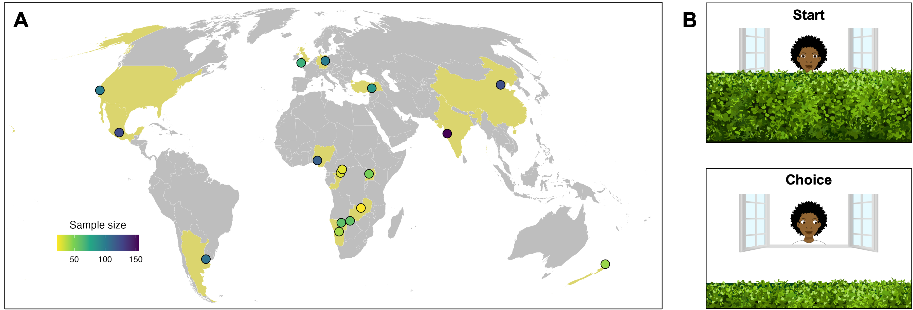

```{r setup, include = FALSE}
library("papaja")
library(tidyverse)
library(knitr)
library(kableExtra)
```

```{r analysis-preferences}
# Seed for random number generation
set.seed(42)
knitr::opts_chunk$set(cache.extra = knitr::rand_seed, message = F, warning = F)
options(knitr.kable.NA = '')
```

```{r data}
data <- read_csv("../data/gafo-cc-clean-data.csv")%>%
  mutate(continent = ifelse(
    community %in% c("leipzig", "plymouth"), "Europe", 
    ifelse(
      community %in% c("akure", "hai||om", "khwe", "chimfunshi", "bandongo", "bayaka", "windhoek", "uganda"), "Africa",
      ifelse(community %in% c("stanford", "mexico", "buenos_aires"), "America",
             ifelse(community %in% c("india", "beijing", "turkey"), "Asia", "Oceania"))
    )
  ))%>%
  mutate(continent = factor(continent, levels = c("America", "Africa", "Europe", "Asia", "Oceania"), ordered = T))%>%
  mutate(community = recode(community,
                            akure = "Akure (Nigeria)",
                            leipzig = "Leipzig (Germany)",
                            `hai||om` = "Hai||om (Namibia)",
                            khwe = "Khwe (Namibia)",
                            windhoek = "Windhoek (Namibia)",
                            stanford = "Stanford (USA)",
                            chimfunshi = "Chimfunshi (Sambia)",
                            mexico = "Ocuilan (Mexico)",
                            plymouth = "Plymouth (UK)",
                            beijing = "Beijing (China)", 
                            india = "Pune (India)",
                            buenos_aires = "Buenos Aires (Argentina)",
                            auckland = "Auckland (New Zealand)",
                            turkey = "Malatya (Turkey)",
                            bandongo = "Bandongo (Rep. Congo)",
                            bayaka = "BaYaka (Rep. Congo)", 
                            uganda = "Nyabyeya (Uganda)"))
```


Social cognition is a defining aspect of the human species [@tomasello2005understanding; @laland2021understanding; @wellman2014making]. It is supposed to enable unique forms of communication and cooperation that underlie cumulative cultural evolution and the formation of complex societies [@henrich2016secret; @tomasello2003makes; @legare2019development]. The eyes are the proverbial window to the mind and the starting point for a majority of social reasoning processes [@shepherd2010following]. Gaze is used to infer the focus of visual attention, which is a critical aspect of coordinated activities, including communication and cooperation [@tomasello2007reliance; @scaife1975capacity]. The ability to follow gaze emerges early in childhood [@tang2023slow; @gredeback2010development; @byers2021development] and individual differences in children's gaze following ability predict later life outcomes, most notably, later communicative abilities [@brooks2005development; @carpenter1998social]. Underlying this narrative is the wide-held assumption that gaze following is fundamental to human social cognition and, therefore, works and develops in the same way across human societies despite substantial variation in developmental contexts. This claim, however, lacks a solid empirical foundation. 

We conducted a large-scale cross-cultural study on the development of gaze-following abilities to study potentially universal processing signatures and their development. Previous developmental studies focused on the onset of gaze following in infancy [@hernik2019infant; @callaghan2011early]. The `r n_distinct(data$subjid)` participants in the study lived in 17 different communities spread over five continents (Fig. \@ref(fig:fig1)A, Tab. \@ref(tab:tab1)). The countries from which data was contributed to the study represented 46 % of the world's population. Communities covered a broad spectrum of geographical locations, social and political systems, languages, and subsistence styles (see Supplemental Materials). 

```{r fig1, include = T, fig.align = "center", fig.cap = "(B) Screenshot from the task. The scene depicts the choice phase in a test trial. Participants had to use the gaze of the agent to locate the balloon and click on the hedge where they thought the balloon was. Agents, audio recordings and backgrounds were adpated to each cultural setting.", out.width="100%"}

``` 

```{r tab1, echo=F}
tba1 <- data %>%
  separate(community, into = c("community", "country"), sep = " \\(")%>%
  mutate(country = str_remove(country, "\\("),
         country = str_remove(country, "\\)"))%>%
  distinct(subjid, .keep_all = T)%>%
  group_by(community, country, continent)%>%
  summarise(N = n_distinct(subjid), 
            m = sum(sex == "m", na.rm = T), 
            mean_age = mean(ageinyears),
            min_age = min(ageinyears), 
            max_age = max(ageinyears), 
            touchscreen = mean(touchscreen, na.rm = T))%>%
  mutate_if(is.numeric, format, digits = 2, nsmall = 2)%>%
  mutate(age = paste0(mean_age, " (", min_age, " - ", max_age, ")"))%>%
  mutate(N = paste0(N, " (", m,")"))%>%
  select(-c(mean_age, min_age, max_age))%>%
  arrange(continent, country)%>%
  group_by(continent) %>%
  mutate(continent = replace(continent, duplicated(continent), " ")) %>%
  ungroup %>%
  mutate(country = replace(country, duplicated(country), " "))%>%
  mutate(language = c("Spanish (Rioplatense)", "Spanish (Mexican)", "English (American)", "Hai||om", "Khwedam", "English (Nigerian)", "English (Nigerian)", "BaYaka", "Lingala", "Bemba", "Swahili", "German", "English (British)", "Mandarin", "English (Indian) / Marathi", "Turkish", "English (New Zealand)"),
           market_integration = c("high", "medium", "high", "low", "low", "high", "high", "low", "low", "medium", "medium", "high", "high", "high", "high", "high", "high"))%>%
  select(continent, country, community, N, age, language, market_integration, touchscreen)


kableExtra::kable(tba1,
             col.names = linebreak(c("Continent", "Country", "Community", "N(male)", "Age (range)", "Language", "Market integration","Touchscreen")),
             caption = "Participant demographics.", 
             format="latex", booktabs=TRUE
             )%>% 
  kable_styling(latex_options="scale_down")
```

We used an animated picture book tablet task in which participants were asked to locate a hidden object based on observing an agent's gaze. Children watched a balloon disappear behind a hedge. An agent followed the trajectory of the balloon with their eyes (Fig. \@ref(fig:fig1)B). The key dependent variable was the precision with which children located the agent's focus of attention, that is, the deviation between where the agent looked (where the object was) and where the child thought the agent looked. We adapted visuals and audio instructions specifically to each of the 17 communities. Previous work demonstrated excellent individual-level measurement properties for this task [@prein2023tango]. Thus, in addition to group-level trends, we were able to investigate individual-level variation. 

```{r}
post_agg <- readRDS("../saves/post_agg.rds")
post_fix <- readRDS("../saves/cult_age_fix.rds")

```

As the first step, we investigated developmental gains. Across all 17 communities, we found a substantial increase in average levels of precision with age (fixed effect: $\beta$ = `r post_fix%>%filter(term == "ageinyears")%>%pull(Estimate)`, 95% HDI (`r post_fix%>%filter(term == "ageinyears")%>%pull(Q2.5)` - `r post_fix%>%filter(term == "ageinyears")%>%pull(Q97.5)`); range of community-level effects: $\beta_{min}$ = `r post_agg%>%filter(type == "ageinyears")%>%arrange(mean)%>%tail(1)%>%pull(mean)`, 95% HDI (`r post_agg%>%filter(type == "ageinyears")%>%arrange(mean)%>%tail(1)%>%pull(lci)` - `r post_agg%>%filter(type == "ageinyears")%>%arrange(mean)%>%tail(1)%>%pull(uci)`) to $\beta_{max}$ = `r post_agg%>%filter(type == "ageinyears")%>%arrange(mean)%>%head(1)%>%pull(mean)`, 95% HDI (`r post_agg%>%filter(type == "ageinyears")%>%arrange(mean)%>%head(1)%>%pull(lci)` - `r post_agg%>%filter(type == "ageinyears")%>%arrange(mean)%>%head(1)%>%pull(uci)`). There were marked differences between communities: highly market-integrated communities around the globe showed higher levels of precision compared to less market-integrated communities. However, we believe that these results are better explained by exposure to technology than market integration. We discuss them in more detail below. Differences between communities were small compared to differences between individuals: communities did not form homogeneous clusters but largely overlapping distributions in that some individuals from communities with a lower average level of precision performed better compared to some individuals from a setting with a very high average level of precision. Furthermore, in all communities, some 4-year-olds outperformed children two years older than them (see Fig. \@ref(fig:fig2)A).

```{r fig2, include = T, fig.align = "center", fig.cap = "A) Developmental trajectories by cultural settings. Transparent dots show aggregated data for each individual. The color dentoes the different cultural settings. The developmental trajectories are predicted based on a model of the data aggregated for each participant. B) Performance by screen section and cultural setting. Each bin covers 1/10th of the screen. Points show means and eroor bars 95\\% confidence intervals for the data within that bin aggregated across participants.", out.width="75%"}
knitr::include_graphics("../visuals/pvis_pred.png")
```

Consistent developmental gains alone cannot inform us about the cognitive processes children use when locating the agent's focus of attention. Recent computational work modeled gaze following as social vector estimation [@prein2023variation]. When observing the eyes, onlookers estimate a vector from the center of the eye through the pupil. The focus of attention is the location wherever the estimated vectors from both eyes hit a surface (Fig. \@ref(fig:fig1)C). The estimation process is not perfect, but each individual has a systematic level of uncertainty, which is conceptualized as the cause of individual differences. Importantly, this process model predicts a clear performance signature in our cross-cultural gaze following task: Trials in which the agent looks further away from the center (i.e. to the left or right side of the screen) should result in lower levels of precision, compared to trials in which the agent looks closer to the middle. This prediction is best understood by considering a similar phenomenon: pointing a torch light to a flat surface. The width of the light beam represents each individual's level of uncertainty in vector estimation. When the torch is directed straight down, the light beam is concentrated in a relatively small area. When the torch is rotated to the side, the light from one half of the cone must travel further than the light from the other half to reach the surface. As a consequence, the light is spread over a wider area. 

The processing signature was clearly visible across all 17 communities. Precision decreased when the agent looked at locations further away from the center (fixed effect: $\beta$ = `r post_fix%>%filter(term == "targetcentralityx")%>%pull(Estimate)`, 95% HDI (`r post_fix%>%filter(term == "targetcentralitx")%>%pull(Q2.5)` - `r post_fix%>%filter(term == "targetcentralityx")%>%pull(Q97.5)`); range of community-level effects: $\beta_{min}$ = `r post_agg%>%filter(type == "targetcentrality")%>%arrange(mean)%>%tail(1)%>%pull(mean)`, 95% HDI (`r post_agg%>%filter(type == "targetcentrality")%>%arrange(mean)%>%tail(1)%>%pull(lci)` - `r post_agg%>%filter(type == "targetcentrality")%>%arrange(mean)%>%tail(1)%>%pull(uci)`) to $\beta_{max}$ = `r post_agg%>%filter(type == "targetcentrality")%>%arrange(mean)%>%head(1)%>%pull(mean)`, 95% HDI (`r post_agg%>%filter(type == "targetcentrality")%>%arrange(mean)%>%head(1)%>%pull(lci)` - `r post_agg%>%filter(type == "targetcentrality")%>%arrange(mean)%>%head(1)%>%pull(uci)`). Visualization of the data showed the predicted u-shaped pattern in all communities (see Fig. \@ref(fig:fig2)B). These results indicate a universal cognitive process used by children in all communities. There is, however, an alternative way in which the u = shaped pattern might arise: it would also arise when participants ignored the agent's gaze and instead always selected the middle of the screen (center bias). To rule out this alternative explanation, we directly compared three cognitive models that made different assumptions about how participants' responses were generated: the focal vector-based gaze estimation model described above, a center-bias model where participants always select the center, and a random guessing model where participants select random locations. For every community, we found overwhelming support for the gaze estimation model (min $BF_{10}$ < 1000 for comparisons with both alternative models). Taken together, children from all 17 communities processed gaze in similar ways.

```{r}
pred_est <- readRDS("../saves/pred_est.rds")
```

What is left to explain are the marked community- and individual-level differences. In addition to the gaze-following task, caregivers filled out a small questionnaire about children's access to screen-based technology and the composition of their households. On an individual level, we found that across communities, children with access to touchscreen devices had higher levels of precision ($\beta$ = `r pred_est%>%filter(term == "touchscreen1")%>%pull(Estimate)`, SE = `r pred_est%>%filter(term == "touchscreen1")%>%pull(Est.Error)`, 95% CrI = `r pred_est%>%filter(term == "touchscreen1")%>%pull(Q2.5)` - `r pred_est%>%filter(term == "touchscreen1")%>%pull(Q97.5)`). On a community level, we also saw that average performance was lowest in the communities in which touchscreen devices were the least frequent (Fig. \@ref(fig:fig3)). Thus, methodological factors likely explained the marked differences between communities. 

```{r fig3, include = T, fig.align = "center", fig.cap = "Correlation between performance in the gaze-following task and the exposure to touchscreens on a cultural setting-level. Realtive imprecision accounts for differences in age between settings in that it corresponds to the random intercept estimate for each setting in a model predicting performance by age.", out.width="50%"}
knitr::include_graphics("../visuals/pcomtc.png")
```

On an individual level, other factors likely generated individual differences because there was substantial variation even in communities where almost all children had access to touchscreens. Previous work suggested that social cognition develops in social interaction [@barresi1996intentional; @perner1994theory; @rakoczy2022foundations], in particular, with older siblings [@lewis1996social; @ruffman1998older]. We found tentative support for this idea in the form of a small but consistent effect in the direction that participants living together with more children older than themselves had slightly higher levels of precision ($\beta$ = `r pred_est%>%filter(term == "older_children")%>%pull(Estimate)`, SE = `r pred_est%>%filter(term == "older_children")%>%pull(Est.Error)`, 95% CrI = `r pred_est%>%filter(term == "older_children")%>%pull(Q2.5)` - `r pred_est%>%filter(term == "older_children")%>%pull(Q97.5)`).

Following and understanding gaze is a foundational building block of human social cognition [@tomasello2007reliance; @scaife1975capacity]. A substantial body of work has explored the developmental onset of gaze following in a few selected cultural settings [@tang2023slow; @gredeback2010development; @byers2021development; @hernik2019infant; @callaghan2011early]. The data reported here provides evidence that children all over the world process gaze in the same way. Key performance signatures of a model that sees gaze following as a form of social vector estimation were found in the data of all 17 distinct cultural communities. The cognitive processes underlying gaze following are thus likely to be rooted in humans' evolved cognitive architecture, which is -- presumably -- later refined during social interaction. The phylogenetic roots of these processes might possibly lie much deeper as primates from a wide range of species follow gaze [@rosati2009looking; @tomasello1998five; @itakura2004gaze]. Yet, if they also show the same processing signatures has yet to be explored.      

There are important limitations to this study. The methodological factors that influenced performance might have overshadowed individual and community-level differences that originate from other sources. Importantly, this does not affect our interpretation of the data as evidence for shared cognitive processing because the key processing signatures were present in all communities. The role that social interaction plays as a potential driver of development and source of individual differences is vastly under-explored in the current study. The small effect of the exposure to older children does not indicate which aspects of social interaction enhance gaze processing. Naturalistic data directly recording social interactions across communities would offer crucial information to close this explanatory gap. Recent work in the field of language acquisition has shown how technological innovations can be used to close this explanatory gap. 

The evidence presented here holds far-reaching implications. Our work pioneers a methodological approach that introduces solid individual-level measurement to the cross-cultural study of cognitive development. As such, it serves as a blueprint for future research on a broad spectrum of cognitive abilities. Most importantly, this study offers a much-needed empirical foundation for theories on human nature. The finding that children from diverse cultures deploy similar cognitive processes in interpreting gaze points to an evolutionary basis of basic social cognition, which is refined during development, presumably through social interaction. 

\newpage

# References

::: {#refs custom-style="Bibliography"}
:::
