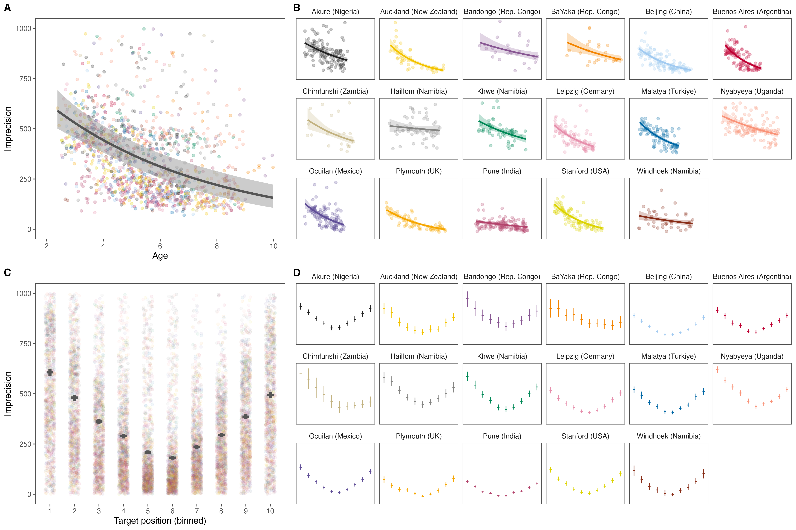
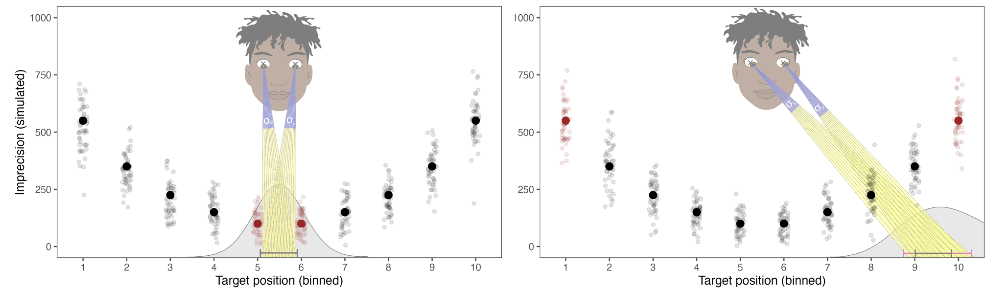

```{r setup, include = FALSE}
library("papaja")
library(tidyverse)
library(knitr)
library(kableExtra)
```

```{r analysis-preferences}
# Seed for random number generation
set.seed(42)
knitr::opts_chunk$set(cache.extra = knitr::rand_seed, message = F, warning = F)
options(knitr.kable.NA = '')
```

```{r data}
data <- read_csv("../data/gafo-cc-clean-data.csv")%>%
  mutate(continent = ifelse(
    community %in% c("leipzig", "plymouth"), "Europe", 
    ifelse(
      community %in% c("akure", "hai||om", "khwe", "chimfunshi", "bandongo", "bayaka", "windhoek", "uganda"), "Africa",
      ifelse(community %in% c("stanford", "mexico", "buenos_aires"), "Americas",
             ifelse(community %in% c("india", "beijing", "turkey"), "Asia", "Oceania"))
    )
  ))%>%
  mutate(continent = factor(continent, levels = c("Americas", "Africa", "Europe", "Asia", "Oceania"), ordered = T))%>%
  mutate(community = recode(community,
                            akure = "Akure (Nigeria)",
                            leipzig = "Leipzig (Germany)",
                            `hai||om` = "Hai||om (Namibia)",
                            khwe = "Khwe (Namibia)",
                            windhoek = "Windhoek (Namibia)",
                            stanford = "Stanford (USA)",
                            chimfunshi = "Chimfunshi (Zambia)",
                            mexico = "Ocuilan (México)",
                            plymouth = "Plymouth (UK)",
                            beijing = "Beijing (China)", 
                            india = "Pune (India)",
                            buenos_aires = "Buenos Aires (Argentina)",
                            auckland = "Auckland (New Zealand)",
                            turkey = "Malatya (Türkiye)",
                            bandongo = "Bandongo (Rep. Congo)",
                            bayaka = "BaYaka (Rep. Congo)", 
                            uganda = "Nyabyeya (Uganda)"))
```

# Research Transparency Statement

All authors declare no conflicts of interest. Preregistration: The hypotheses, methods and parts of the analysis plan were preregistered ( <!-- https://osf.io/tdsvc/?view_only=f404d66c967542f28ce4af16371f34e6--> Whttps://osf.io/tdsvc) on March 12th, 2022, prior to data collection which began on on March 18th, 2022. Additional analysis and deviations from the preregistration are reported in the Supplementary Material. Materials: All study materials are publicly available <!--[masked for peer review] --> (https://ccp-odc.eva.mpg.de/tango-cc/). Data: All primary data are publicly available <!--[masked for peer review; see .zip file included--> (https://github.com/ccp-eva/gafo-cc-analysis/). Analysis scripts: All analysis scripts are publicly available <!--[masked for peer review; see .zip file included]--> (https://github.com/ccp-eva/gafo-cc-analysis/). 

# Introduction 

Human socio-cognitive skills enable unique forms of communication and cooperation that provide a bedrock for cumulative culture and the formation of complex societies  [@tomasello2020adaptive; @laland2021understanding; @wellman2014making; @henrich2016secret; @tomasello2003makes; @legare2019development; @heyes2018cognitive]. The eyes are the proverbial "window to the mind" and eye gaze is essential for many social reasoning processes  [@shepherd2010following; @doherty2006development; @emery2000eyes]. Others’ eye gaze is used to infer their focus of visual attention, which is a critical aspect of coordinated activities, including communication and cooperation [@tomasello2007reliance; @scaife1975capacity; @langton2000eyes; @rossano2012gaze; @richardson2005looking; @sebanz2006joint]. 

The ability to follow gaze emerges early in development [@tang2023slow; @gredeback2010development; @byers2021development; @del2019developmental]. The earliest signs of gaze-following have been found in infants as young as four months [@astor2021gaze; @d1997demonstration]. Initially, infants rely more on head direction than actual gaze direction [@michel2021effects; @lempers1977development]. Throughout the first two years of life, children refine their abilities: they interpret gaze in mentalistic terms, for example, they follow gaze to locations outside their own visual field by moving around barriers [@moll200412]. Importantly, individual differences in children’s gaze-following abilities predict later life outcomes, most notably communicative abilities [@carpenter1998social]. For example, gaze-following at 10 months predicts language scores at 18 months of age [@brooks2005development]. Difficulties with gaze-following have been linked to developmental disorders, including Autism [@itier2009neural; @thorup2016altered; @thorup2018reduced]. This work highlights the importance of gaze-following as a foundational building block of human social interaction and its central place in theorizing. 

A central assumption in the theoretical and empirical work discussed above is that, despite substantial variation in developmental contexts, gaze-following works and develops in the same way across human societies [@tomasello2019becoming]. This assumption -- despite being central to many developmental theories -- is currently not supported by evidence. On the contrary, cross-cultural studies have revealed substantial diversity in socio-cognitive development [@miller2018contributions; @wellman2014making; @mayer2013synchrony; @dixson2018scaling; @taumoepeau2019cross]. One of the very few cross-cultural studies also found differences in the likelihood to follow gaze between communities [@callaghan2011early].  

One potential source for this paradox lies in the reliance on aggregated measures in cross-cultural studies. Absolute differences in mean performance across communities are interpreted as a signal of different underlying cognitive processes. In the present study, we resolve this paradox by instead focusing on processing signatures that can be investigated independently of absolute community-level differences. This allows us to directly evaluate the empirical foundation of claims about universal features of human social cognition. To this end, we conducted a pre-registered, large-scale, cross-cultural study on the development of gaze-following abilities to study potentially universal processing signatures. 

The processing signatures were derived from a computational model that assumes that participants follow gaze by estimating a vector emanating from the eye center through the pupil [@prein2023variation]. The key innovation of the model is that it explains how individuals may use the same cognitive process but still differ in their measured abilities. The process always involves estimating a vector but also involves a degree of uncertainty because the eye center is not directly observable. Individuals are assumed to differ in their level of uncertainty with which they estimate the vector which causes differences in their observable behavior. Importantly, the assumed process leaves a key signature in the data that is observable independent of the absolute level of performance. In the present study, we therefor focus on this signature instead of absolute levels of performance when evaluating the claim whether there is evidence for a universal cognitive mechanism underlying gaze-following. 

The `r n_distinct(data$subjid)` participants who took part in the study lived in 17 different communities across 14 countries and five continents (Fig. \@ref(fig:fig1)A, Tab. \@ref(tab:tab1)). These countries represent ~46% of the world’s population. Communities covered a broad spectrum of geographical locations, social and political systems, languages, and subsistence styles (see Supplementary Material). This diversity allowed us to overcome the common pitfall of cross-cultural studies that compare urban communities from the global north to rural communities from the global south [@barrett2020towards]. 

```{r fig1, include = T, fig.align = "center", fig.cap = "(A) Data collection sites. Points show the approximate geographical location of the data collection sites, coloring shows the sample sizes. (B) Screenshots from the task. Screenshots from the task. The upper scene depicts the start and the lower the choice phase in a test trial. Participants had to use the gaze of the agent to locate the balloon and touch the location on the hedge where they thought the balloon was. Agents, audio recordings and backgrounds were adapted to each cultural setting. (C) Drawings used as agents across cultural settings.", out.width="100%"}
knitr::include_graphics("../figures/fig1_2.png")
``` 

```{r tab1, include = T}
tba1 <- data %>%
  separate(community, into = c("community", "country"), sep = " \\(")%>%
  mutate(country = str_remove(country, "\\("),
         country = str_remove(country, "\\)"))%>%
  distinct(subjid, .keep_all = T)%>%
  group_by(community, country, continent)%>%
  summarise(N = n_distinct(subjid), 
            m = sum(sex == "m", na.rm = T), 
            mean_age = mean(ageinyears),
            min_age = min(ageinyears), 
            max_age = max(ageinyears), 
            touchscreen = mean(touchscreen, na.rm = T))%>%
  mutate_if(is.numeric, format, digits = 2, nsmall = 2)%>%
  mutate(age = paste0(mean_age, " (", min_age, " - ", max_age, ")"))%>%
  mutate(N = paste0(N, " (", m,")"))%>%
  select(-c(mean_age, min_age, max_age))%>%
  arrange(continent, country)%>%
  group_by(continent) %>%
  mutate(continent = as.character(continent),
         continent = replace(continent, duplicated(continent), " ")) %>%
  ungroup() %>%
  mutate(country = replace(country, duplicated(country), " "))%>%
  mutate(language = c("Spanish (Rioplatense)", "Spanish (Mexican)", "English (American)", "Hai||om", "Khwedam", "English (Nigerian)2", "English (Nigerian)", "BaYaka", "Lingala", "Kiswahili", "Bemba", "German", "English (British)", "Mandarin", "English (Indian) / Marathi", "Turkish", "English (New Zealand)"))%>%
  select(continent, country, community, N, age, language, touchscreen)

apa_table(tba1,
          col.names = linebreak(c("Continent", "Country", "Community", "N(male)", "Age (range)", "Language", "Touchscreen exposure1")),
          caption = "Participant demographics.",
          align = paste0("m{", 1/(ncol(tba1) + 1), "\\linewidth}"),
          longtable = TRUE,
          note = "1 Proportion of participants who have access to touchscreens according to parental questionnaire. 2 Local collaborators and piloting suggested that Nigerian English is suitable for Windhoek as well.",
          escape=TRUE)
```

We used an animated picture book tablet task in which participants had to locate a hidden object based on observing an agent’s gaze. Children watched a balloon disappear behind a hedge. An agent followed the trajectory of the balloon with their eyes (Fig. \@ref(fig:fig1)B). The key dependent variable was the (im)precision with which children located the agent’s focus of attention, that is, the deviation between where the agent looked (where the balloon was) and the child’s response. We adapted visuals and audio instructions specifically for each of the 17 communities. Previous work demonstrated excellent individual-level measurement properties for this task in a German sample [@prein2023tango].

```{r}
post_agg <- readRDS("../saves/post_agg.rds")
post_fix <- readRDS("../saves/cult_age_fix.rds")

```

# Methods

## Participants

```{r}
demtab <- data %>%
  separate(community, into = c("community", "country"), sep = " \\(")%>%
  mutate(country = str_remove(country, "\\("),
         country = str_remove(country, "\\)"))%>%
  distinct(subjid, .keep_all = T)%>%
  group_by(community, country, continent)%>%
  summarise(N = n_distinct(subjid), 
            m = sum(sex == "m", na.rm = T), 
            mean_age = mean(ageinyears),
            min_age = min(ageinyears), 
            max_age = max(ageinyears))%>%
  mutate_if(is.numeric, format, digits = 2, nsmall = 2)%>%
  mutate(age = paste(mean_age, " (", min_age, " - ", max_age, ")"))%>%
  select(-c(mean_age, min_age, max_age))%>%
  arrange(continent)
```

A total of `r sum(as.numeric(demtab$N))` children between `r round(min(data$ageinyears), 2)` and `r round(max(data$ageinyears), 2)` provided data for the study. Children lived in `r n_distinct(data$community)` different communities, located in `r n_distinct(demtab$country)` different countries. Table \@ref(tab:tab1) gives the sample size per community together with some basic demographic information. The recruitment strategy for each community is reported in the respective site descriptions. For some children, the exact birthday was unknown. In such cases, we set the birthday to the 30th of June of the year that would make them fall into the reported age category. 

Data from children was only included in the study when they contributed at least four valid test trials. We also excluded the data from children with a diagnosed developmental disorder. In sum, in addition to the sample size reported above, 74 additional children participated in the study but did not contribute data. The main reasons for exclusion were: contribution of less than four valid test trials, technical failures, and missing or implausible demographic information (e.g., when the number of children living in the household was reported to be larger than the household itself or when the number of children reported to live in the household equaled the number of children younger than the child being tested). We did not exclude any participants for performance reasons. A detailed description of each data collection site and the way children were recruited can be found in the Supplementary Material.

## Setup and Procedure

The task was implemented as a browser-based interactive picture book using `HTML` and `JavaScript`. Participants saw animated agents on a touch screen device, listened to pre-recorded audio instructions and responded by touching the screen. In all communities, a research assistant, fluent in the local language(s), guided the child through the task. 

Figure \@ref(fig:fig1)B shows a screenshot from the task. The task was introduced verbally by the assistant as the balloon game in which the participant would play with other children to find a balloon. On each trial, participants saw an agent located in a window in the center of the screen. A balloon fell down from its starting position just below the agent. The agent's gaze followed the trajectory of the balloon. That is, the pupils and the iris were programmed to align with the center of the balloon. Once the balloon had landed on the ground, the agent was instructed to locate it, that is, to touch the location on the screen where they thought the balloon was. On each trial, we recorded the exact x-coordinate of the participant's touch.

There were two types of familiarization trials. In fam1 trials, the balloon fell down and landed in plain sight. Participants simply had to touch the visible balloon. In fam2 trials, the trajectory of the balloon was visible but it landed behind a small barrier (a hedge - see Figure \@ref(fig:fig1)B). Thus, participants needed to touch the hedge where they saw the balloon land. Next came test trials. Here, the barrier moved up and covered the balloon's trajectory. That is, participants only saw the agent's eyes move, but not the balloon. They had to infer the location of the balloon based on the agent's gaze direction. During fam1, fam2 and the first test trial, children heard voice overs commenting what happened on the screen. Critically, the agent was described as wanting to help the child and always looking at the balloon. 

Children completed one fam1 trial, two fam2 trials and 16 test trials. We excluded the first test trial from the analysis because of the voice-over. Thus, 15 test trials were used in the analysis below. Each child saw eight different agents, four male, four female. The agent changed from trial to trial, with alternating genders. A coin toss before the first trial decided whether the first agent was male or female. The order in which agents were shown was randomized with the constraint that all agents had to be shown once until an agent was shown again. The color of the balloon also changed from trial to trial in a random order, also with the constraint that all colors appeared once before any one was repeated.

The location (x-coordinate) where the balloon landed was determined in the following way: The screen was divided in ten equally sized bins. On each trial, one of the bins was randomly selected and the exact x-coordinate was randomly chosen within that bin. Constraints were that the balloon landed in each bin equally often and the same bin appeared no more than twice in a row. 

All children were tested with a touchscreen device with a size between 11 and 13 inch equipped with a webcam. The data was either stored locally or sent to a server. In addition to the behavioral data, we stored the webcam recording of the session for verification purposes. Culture-specific adaptations were made by changing the visuals and the audio instructions (see Supplementary Material for details).

In addition to the gaze-following task, caregivers responded to a short questionnaire about children’s access to screens and touchscreens (binary answer) as well as the number of people, children and children younger than the focal child living in the household (numeric; see Supplementary Material for details). The numeric variables were scaled within cultural setting prior to inclusion into the regression models.

# Analysis

## Regression models

We used Bayesian Regression models fit in `R` [@r] using the package `brms` [@burkner2017brms] for all analyses except the cognitive models (see below). We used default priors built into `brms`. The dependent variable in all regression models was imprecision, that is, the absolute distance between the true location of the balloon (x-coordinate of its center) and the location where the participant touched the screen. We used a Log-normal distribution to model the data because the natural lower bound for imprecision is zero and the data was right skewed with a long tail. Numeric predictors that entered the models were scaled to have a mean of zero and a standard deviation of 1.

To analyse cross-cultural variation in performance, we used a cross-validation procedure [see e.g., @stengelin2023children]. In the Supplementary Material we give a detailed justification of this approach. For each cultural setting, we randomly sampled a data set that was 5/6 the size of the full data set (training data). Then, we fit the model to this training data and used the estimated model parameters to predict the remaining 1/6 of the data (testing data). We then compared the model predictions from the different models by computing the mean difference between the true and predicted imprecision, over all trials in the testing data set. We repeated the cross-validation procedure 100 times and computed the percentage of cases in which one model outperformed the other. We compared three models: a null model assuming no systematic community-level variation, a model assuming variation between communities and a model assuming variation between communities and in developmental trajectories (see Supplementary Material for model equations). 

To evaluate the processing signatures predicted by the cognitive model that trials in which the balloon lands further away from the center lead to larger imprecision (see next section for details), we fit a model predicting imprecision by age and target centrality (distance of the landing position form the center in pixel) with random intercepts for participant and cultural setting and random slopes for target centrality within participant and cultural setting (`brms` notation: `age + target_centrality + (target_centrality | participant) + (age + target_centrality | culture)`).

## Cognitive model

Recent computational work modeled gaze-following as social vector estimation [@prein2023variation]. When following gaze, onlookers observe the location of the pupil within the eye and estimate a vector emanating from the center of the eye through the pupil. The focus of attention is the location where the estimated vectors from both eyes hit a surface (Fig. \@ref(fig:fig12)). It is assumed that this estimation process has some uncertainty because the center of the eye is not directly observable and that individuals vary in their level of uncertainty. As a consequence, even though individuals use the same general process, they might differ in their absolute levels of precision. Crucially, this process model predicts a clear performance signature in our gaze-following task: Trials in which the agent looks further away from the center should result in lower levels of precision compared to trials in which the agent looks closer to the center. This prediction is best understood by considering a similar phenomenon: pointing a torch light to a flat surface. The width of the light beam represents each individual’s level of uncertainty in vector estimation. When the torch is directed straight down, the light beam is concentrated in a relatively small area. When the torch is rotated to the side, the light from one half of the cone must travel further than the light from the other half to reach the surface. As a consequence, the light is spread over a wider area (see Fig. \@ref(fig:fig12)).

The model inversely models the process generating touches on the screen based on observed eye movements and is defined as:

\begin{equation}
    P(\theta | x_c, \alpha_l, \alpha_r) \propto P(x_c | \alpha_l, \alpha_r, \theta)P(\theta)
\end{equation}

Here, $\theta$ represents an individual's cognitive ability to locate the focus of the agent's attention, $x_c$ represents the touched coordinate, and $\alpha_l$ and $\alpha_r$ correspond to the left and right pupil angles (each defined as the angle between a line connecting the center of the eye to the pupil and a line extended vertically downward from the center of the eye).

The basic assumption in this model is that participants touch on the screen location where they think the agent is looking. The true eye angles ($\alpha_l$ and $\alpha_r$) are not directly observable and are estimated with noise, yielding $\hat{\alpha_l}$ and $\hat{\alpha_r}$. 

Each touch $x_c$ implies a "matched pair" of estimated pupil angles $\hat{\alpha_l}$ and $\hat{\alpha_r}$, with the constraint that the lines extended along those two angles meet at the precise location of where the target is believed to be. As a consequence, we can rewrite the likelihood function of the model as:

\begin{equation}
P(x_c | \alpha_l, \alpha_r, \theta) \propto P(\hat{\alpha_l}, \hat{\alpha_r} | \alpha_l, \alpha_r, \theta) P(x_c)
\end{equation}

$P(x_c)$ is a prior over potential target locations. Because the target was last visible in the screen and because the agent was located in the center, we assumed that participants have an a priori expectation that the target will land close to the middle. We estimated the strength of this center bias (i.e., the standard deviation of a Normal distribution around the screen center) based on the data: $P(x_c) \sim \mathcal{N}(960, \sigma^p)$.

The primary inferential task for participants is therefore to estimate the pupil angles ($\hat{\alpha_l}$ and $\hat{\alpha_r}$), i.e., to sample from the term $P(\hat{\alpha_l}, \hat{\alpha_r} | \alpha_l, \alpha_r, \theta)$. Here, we assumed that the pair of estimated pupil angles were sampled from a probability distribution which is the product of two Normal distributions of equal variance, $\sigma_v$, centered on the true pupil angles:

\begin{equation}
P(\hat{\alpha_l}, \hat{\alpha_r} | \alpha_l, \alpha_r, \theta) \propto \phi(\hat{\alpha}_l ; \alpha_l, \sigma_v)\phi(\hat{\alpha}_r ; \alpha_r, \sigma_v),
\end{equation}

Here, $\sigma_v$ determines the level of accuracy with which participants estimated the pupil angles, and it is thus the component of the model that defines $\theta$. Smaller values of $\sigma_v$ result in a narrow distribution around the pupil angle, making touches far away from the target less likely. Conversely, larger values for $\sigma_v$ lead to a wider distribution, making touches far away from the target more likely. To circle back to the analogy introduced above, $\sigma_v$ corresponds to the width of the light beam. Thus, the goal of the model was to estimate participant-specific values for $\sigma_v$: $\sigma_{v_i}$. For more details on how $\sigma_{v_i}$ was estimated, see the Supplementary Material.

To summarize, the model assumes that participant's touches are generated by a process that relies on noisy estimates of the agent's gaze direction. The precision, with which the gaze direction is estimated, varies between participants and increases with development.

As stated above, the key signature prediction of the model is that precision decreases when the balloon lands further away from the center. This pattern, however, also arises when participants ignore the agent's gaze completely and instead follow simple heuristics. We implemented these heuristics as alternative models and directly compared them to the focal model. According to the center bias model, they always try to touch in the center of the screen: $P(x_c) \sim \mathcal{N}(960, 160)$. (960 is the x-coordinate of the center and 160 is the width of the balloon). According to the random guessing model, they randomly touch coordinates on the screen: $P(x_c) \sim \mathcal{U}(0, 1920)$. 

The cognitive models were implemented in the probabilistic programming language `webppl` [@dippl]. All models were run separately for each cultural setting. Information on the prior distributions for all model parameters can be found in the associated online repository. We compared models based on the marginal likelihood of the data for each model, which represents the likelihood of the data while averaging over the prior distribution on parameters. The pair-wise ratio of marginal likelihoods for two models is known as the Bayes Factor. Bayes Factors are a quantitative measure of the predictive quality of a model, taking into account the possible values of the model parameters weighted by their prior probabilities. The incorporation of the prior distribution over parameters in the averaging process implicitly considers model complexity: models with more parameters typically exhibit broader prior distributions over parameter values and broader prior distribution can attenuate the potential gains in predictive accuracy that a model with more parameters might otherwise achieve [@lee2014bayesian].

# Results

## Cross-cultural variation in development

As the first step, we investigated developmental improvements, that is, how children become more precise at estimating the target location with age. Across all 17 communities, we found a substantial increase in average levels of precision with age (fixed effect of age: $\beta$ = `r post_fix%>%filter(term == "ageinyears")%>%pull(Estimate)`, 95% Credible Interval (CrI) (`r post_fix%>%filter(term == "ageinyears")%>%pull(Q2.5)` - `r post_fix%>%filter(term == "ageinyears")%>%pull(Q97.5)`); range of community-level (random) effects: $\beta_{min}$ = `r post_agg%>%filter(type == "ageinyears")%>%arrange(mean)%>%tail(1)%>%pull(mean)`, 95% CrI (`r post_agg%>%filter(type == "ageinyears")%>%arrange(mean)%>%tail(1)%>%pull(lci)` - `r post_agg%>%filter(type == "ageinyears")%>%arrange(mean)%>%tail(1)%>%pull(uci)`) to $\beta_{max}$ = `r post_agg%>%filter(type == "ageinyears")%>%arrange(mean)%>%head(1)%>%pull(mean)`, 95% CrI (`r post_agg%>%filter(type == "ageinyears")%>%arrange(mean)%>%head(1)%>%pull(lci)` - `r post_agg%>%filter(type == "ageinyears")%>%arrange(mean)%>%head(1)%>%pull(uci)`)).

```{r}
cv_cult <- readRDS("../saves/cross_validation_result.rds")
```

Nevertheless, there were also marked differences between communities (see Fig. \@ref(fig:fig2)A). The cross-validation procedure found that a model assuming cross-cultural variation in average performance as well as cross-cultural variation in developmental trajectories outperformed simpler models -- assuming no variation in the shape of developmental trajectories or no variation between settings at all -- in `r round(mean(cv_cult$m3_beats_m2),2)*100`% of cases. 

Average differences in precision between communities were small compared to differences between individuals: communities did not form homogeneous clusters but largely overlapping distributions in that some individuals from communities with a lower average level of precision performed better compared to some individuals from a setting with a very high average level of precision. Similarly, in all communities, some 4-year-olds outperformed children two years older than them (see Fig. \@ref(fig:fig2)A). The lack of adequate individual-level measurement instruments in previous large-scale developmental cross-cultural studies made it impossible to contrast these perspectives.


```{r fig2, include = T, fig.align = "center", fig.cap = "A) Developmental trajectory across and B) by community. The developmental trajectories are predicted based on a model of the data aggregated for each participant. C) Performance by target location on the screen across, and D) by community. Each bin covers 1/10th of the screen. Points show means, and error bars 95% confidence intervals for the data within that bin aggregated across participants. Transparent dots in A) and C) show aggregated data for each individual.", out.width="100%"}

```

## Universal processing signatures

```{r fig12, include = T, fig.align = "center", fig.cap = "Graphical illustration of the cognitive model. Individuals infer the target of an agent’s attention by estimating a vector based on the position of the pupils within the eyes. This process is noisy, illustrated by the different vectors (transparent lines). Individuals differ in their level of precision (indicated by sigma). For a given level of precision, the further the target lands from the centre of the screen, the less precise the model predicts individuals to be. Solid and transparent dots show simulated means and individual data points to illustrate the predicted effect of target position.", out.width="100%"}

``` 

The key processing signature predicted by the cognitive model was that precision should decrease when the balloon landed further away from the center. This signature was clearly visible across all 17 communities (fixed effect for target centrality: $\beta$ = `r post_fix%>%filter(term == "targetcentralityx")%>%pull(Estimate)`, 95% CrI (`r post_fix%>%filter(term == "targetcentralityx")%>%pull(Q2.5)` - `r post_fix%>%filter(term == "targetcentralityx")%>%pull(Q97.5)`); range of community-level (random) effects: $\beta_{min}$ = `r post_agg%>%filter(type == "targetcentrality")%>%arrange(mean)%>%tail(1)%>%pull(mean)`, 95% CrI (`r post_agg%>%filter(type == "targetcentrality")%>%arrange(mean)%>%tail(1)%>%pull(lci)` - `r post_agg%>%filter(type == "targetcentrality")%>%arrange(mean)%>%tail(1)%>%pull(uci)`) to $\beta_{max}$ = `r post_agg%>%filter(type == "targetcentrality")%>%arrange(mean)%>%head(1)%>%pull(mean)`, 95% CrI (`r post_agg%>%filter(type == "targetcentrality")%>%arrange(mean)%>%head(1)%>%pull(lci)` - `r post_agg%>%filter(type == "targetcentrality")%>%arrange(mean)%>%head(1)%>%pull(uci)`)). Visualization of the data showed the predicted u-shaped pattern in all communities (see Fig. \@ref(fig:fig2)B). When we compared the focal vector-based gaze estimation model described above to the alternative center-bias and random guessing models, we found overwhelming support for the gaze estimation model (min $BF_{10}$ > 100 000 for comparisons with both alternative models, see Supplementary Materials) in every community.

```{r}
pred_est <- readRDS("../saves/pred_est.rds")
```

```{r}
ptc_com <- readRDS("../saves/ptc_com.rds")

pttest <- cor.test(ptc_com$Estimate, ptc_com$touchscreen)
```

## Predictors of variation

We used the caregiver questionnaire to explain community- and individual-level variation. On an individual level, we found that children with access to touchscreen devices had higher levels of precision ($\beta$ = `r pred_est%>%filter(term == "touchscreen")%>%pull(Estimate)`, SE = `r pred_est%>%filter(term == "touchscreen")%>%pull(Est.Error)`, 95% CrI = `r pred_est%>%filter(term == "touchscreen")%>%pull(Q2.5)` - `r pred_est%>%filter(term == "touchscreen")%>%pull(Q97.5)`). This effect was consistent across communities in that allowing the effect of access to touchscreens to vary across communities did not improve model fit (see Supplementary Material). On a community level, we also saw that average performance was lowest in communities in which touchscreen devices were the least frequent (community-level correlation between age-corrected imprecision and proportion of children with access to touchscreens: *r* = `r round(pttest$estimate,2)`, 95% CI = `r round(pttest$conf.int[1],2)` - `r round(pttest$conf.int[2],2)`). Thus, familiarity with the device used for data collection likely explains variation between communities. Children with more touchscreen experience were probably better at task handling and thus more likely to precisely touch the location they inferred the agent to look at. 

```{r}
cor_dat <- data%>%
  group_by(subjid, children)%>%
  summarise(click = mean(abs(clickdistfromtargetcenterx)))

ctest <- cor.test(cor_dat$children, cor_dat$click)
```

However, there was substantial variation between individuals that could not be explained by differential exposures to touchscreens alone. For example, in Malatya (Türkyie) where 100% of children had access to touchscreens there was still substantial variation between individuals (see Fig.\@ref(fig:fig1)B). This strongly indicates that other factors likely contributed to individual differences. Social interaction has been highlighted as an important driver of social-cognitive development [e.g., @tomasello2019becoming; @carpendale2020makes; @barresi1996intentional; @perner1994theory; @rakoczy2022foundations] and thus we hypothesized (and pre-registered) that more opportunities for social interaction -- approximated by living in larger households with more children -- would be associated with higher levels of precision. When predicting performance by relative opportunities for social interactions within a community -- while accounting for absolute differences and the prevalence of touchscreens -- we found no strong associations between any of the demographic indicators and performance (see Supplementary Material). 

# Discussion

Following and understanding gaze is a foundational building block of human social cognition [@tomasello2007reliance; @scaife1975capacity; @langton2000eyes; @rossano2012gaze; @richardson2005looking; @sebanz2006joint]. A substantial body of work has explored the developmental onset of gaze-following in a few selected cultural communities [@moore2008development; @tang2023slow; @gredeback2010development; @byers2021development]. The data reported here provides strong evidence that children from a large and diverse set of communities process others’ gaze in similar ways. We found key performance signatures predicted by a model treating gaze-following as a form of social vector estimation across all 17 communities. With the focus on individual-level processing signatures, the study goes beyond previous studies on gaze-following -- focused on the onset of gaze-following in infancy [@hernik2019infant; @callaghan2011early] -- as well as comprehensive cross-cultural studies that compared average developmental trajectories [@house2020universal; @van2018development; @blake2015ontogeny; @kanngiesser2022children]. 

The cognitive processes underlying gaze-following might be rooted in humans’ evolved cognitive architecture, which is -- presumably -- later refined during social interaction [@astor2020social; @movellan2002development; @senju2015early]. The phylogenetic roots of these processes might possibly lie much deeper as primates from a wide range of species follow gaze [@rosati2009looking; @tomasello1998five; @itakura2004gaze; @kano2014cross]. Yet, similarities in overt behavior do not imply the same underlying cognitive processes. The present study defines clear performance signatures that can be explored in other species to test such evolutionary hypotheses.

Our study combined precise individual-level cognitive measurement and individual-level assessment of experience (here: touchscreen exposure) in a large and diverse sample to directly investigate the impact of specific cultural experiences on developmental outcomes. Instead of establishing universality by maximizing the cultural distance between two or three tested communities [@norenzayan2005psychological], this large-scale cross-cultural approach treats children’s cultural experience at scale, shedding light on the big "middle ground" of children’s cultural experience [@barrett2020towards].

The study has important limitations. The fact that performance in the task was correlated with exposure to touchscreens might have overshadowed other sources of variation. However, we think it is in an important innovation that we were able to account for this effect. Most developmental cross-cultural studies do not even question the portability of their measurement instruments. Importantly, the key result that the processing signatures were seen in all cultural settings, is immune to this finding. The potential that lies in the otherwise precise individual-level measurement that our task achieves is largely unexploited. The questionnaire items only offer a very coarse picture into children's actual lived experiences. Whilst household size was a useful proxy for regular social interaction opportunities, the measure does not directly measure the factors that previous work has suggested to be related to the development of gaze-following in younger children, such as attachment quality or the use of gaze in early communicative interactions [@astor2020social; @movellan2002development; @senju2015early]. Future work could increase the resolution with which everyday experiences in children from diverse communities are recorded to compare the drivers behind social-cognitive development as we observe it. Recent work in the field of language acquisition has shown how technological innovations allowed for direct recording of social interactions across communities which can be used to close this explanatory gap [@bergelson2023everyday; @donnelly2021longitudinal]. 

In sum, our work pioneers an approach that introduces computational modeling and precise individual-level measurement to the cross-cultural study of cognitive development. This approach allowed us to test for universals in the human cognitive architecture rather than just overt behavior. As such, it can serve as a blueprint for future research on a broad spectrum of cognitive abilities and offers a much-needed empirical foundation for theories on the nature of the human mind. Children from diverse cultures deploy similar cognitive processes in interpreting gaze, pointing to a universal foundation of basic social cognition, which is refined during development.

\newpage

# References

::: {#refs custom-style="Bibliography"}
:::
