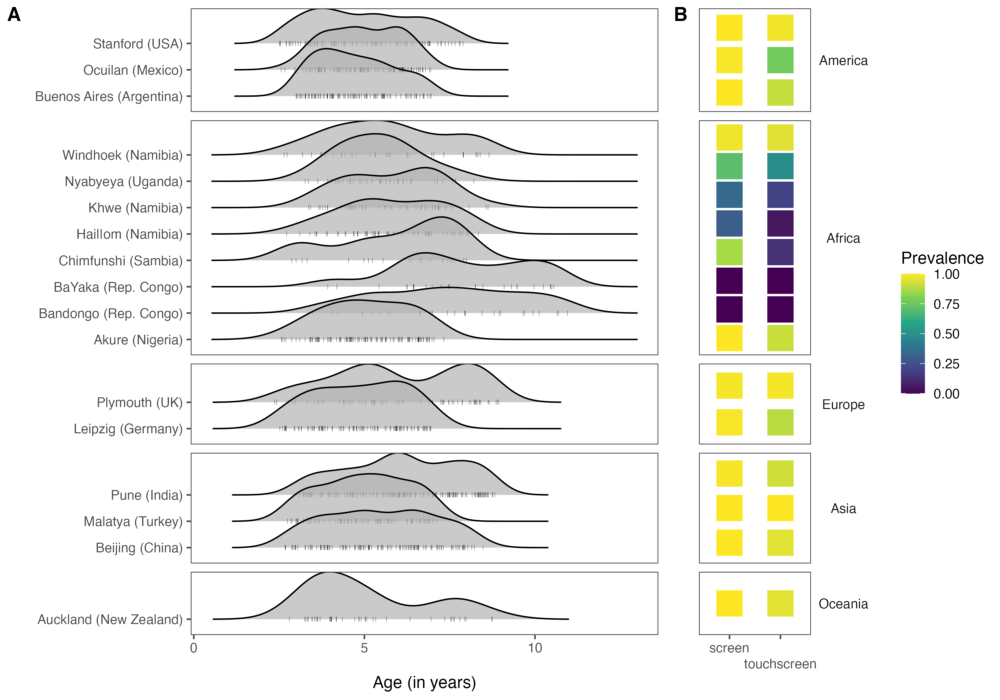
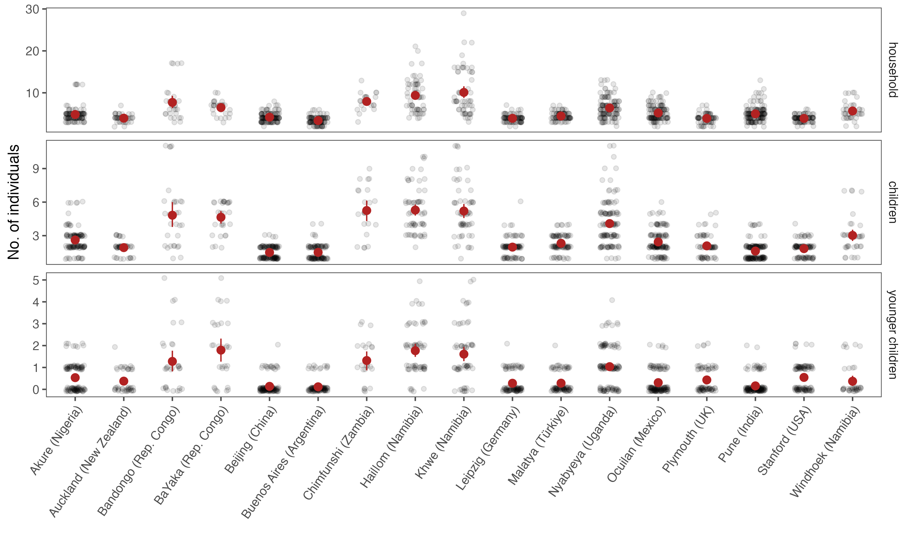
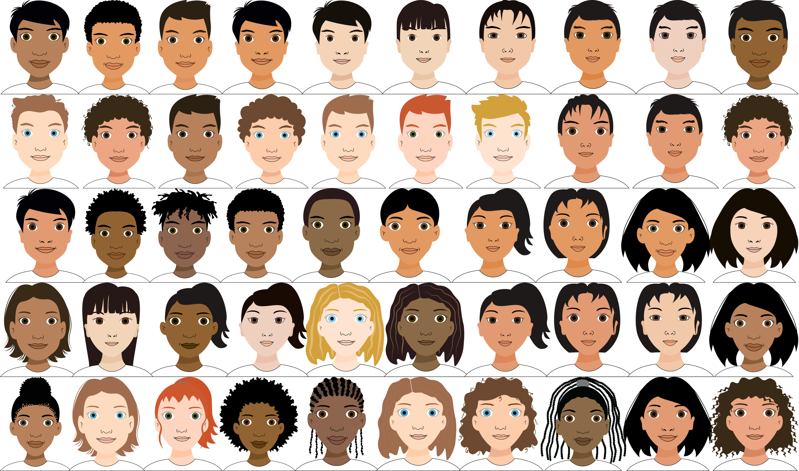
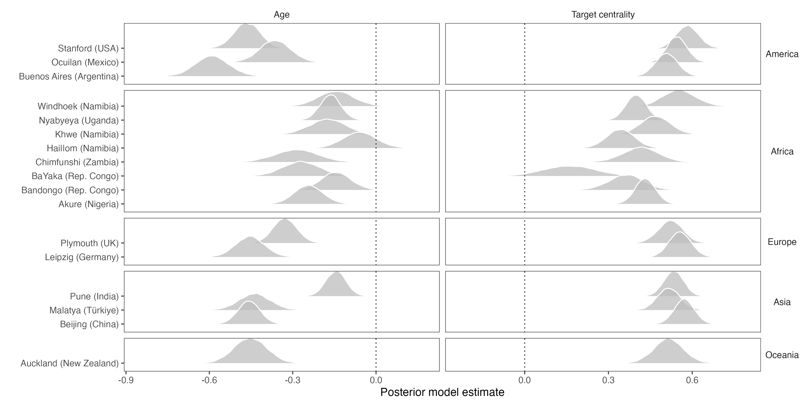
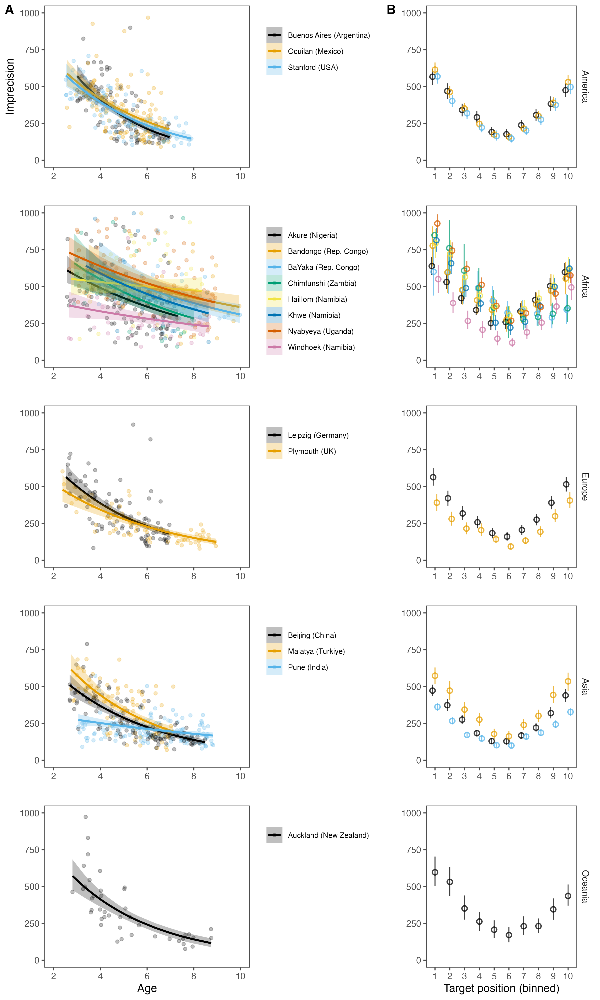
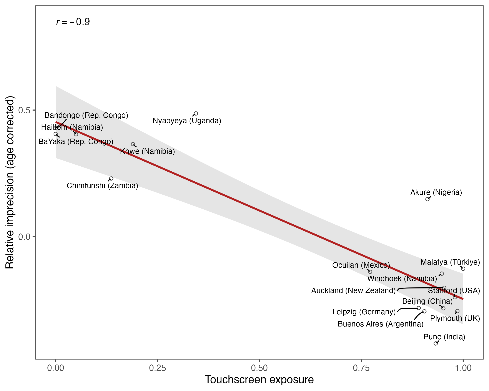

```{r, echo=FALSE, message=F}
library(tidyverse)
library(ggpubr)
library(ggthemes)
library(ggpubr)
library(tidyboot)
library(tidybayes)
library(maps)
library(brms)
library(cowplot)
library(ggridges)
library(papaja)
library(coda)
library(ggrepel)
library(knitr)
library(kableExtra)

estimate_mode <- function(s) {
  d <- density(s)
  return(d$x[which.max(d$y)])
}


hdi_upper<- function(s){
  m <- HPDinterval(mcmc(s))
  return(m["var1","upper"])
}

hdi_lower<- function(s){
  m <- HPDinterval(mcmc(s))
  return(m["var1","lower"])
}

knitr::opts_chunk$set(echo=F, warning=FALSE, message=FALSE, size="small")
options(knitr.kable.NA = '')

set.seed(1337)
```

```{r}
data <- read_csv("../data/gafo-cc-clean-data.csv")%>%
  mutate(continent = ifelse(
    community %in% c("leipzig", "plymouth"), "Europe",
    ifelse(
      community %in% c("akure", "hai||om", "khwe", "chimfunshi", "bandongo", "bayaka", "windhoek", "uganda"), "Africa",
      ifelse(community %in% c("stanford", "mexico", "buenos_aires"), "Americas",
             ifelse(community %in% c("india", "beijing", "turkey"), "Asia", "Oceania"))
    )
  ))%>%
  mutate(continent = factor(continent, levels = c("Americas", "Africa", "Europe", "Asia", "Oceania"), ordered = T))%>%
  mutate(community = recode(community,
                            akure = "Akure (Nigeria)",
                            leipzig = "Leipzig (Germany)",
                            `hai||om` = "Hai||om (Namibia)",
                            khwe = "Khwe (Namibia)",
                            windhoek = "Windhoek (Namibia)",
                            stanford = "Stanford (USA)",
                            chimfunshi = "Chimfunshi (Zambia)",
                            mexico = "Ocuilan (Mexico)",
                            plymouth = "Plymouth (UK)",
                            beijing = "Beijing (China)",
                            india = "Pune (India)",
                            buenos_aires = "Buenos Aires (Argentina)",
                            auckland = "Auckland (New Zealand)",
                            turkey = "Malatya (Türkiye)",
                            bandongo = "Bandongo (Rep. Congo)",
                            bayaka = "BaYaka (Rep. Congo)",
                            uganda = "Nyabyeya (Uganda)"))
```


# Overview

This docuemnt provides a detailed overview of the participants and methods of the in the section [site descriptions](#site-descriptions)

# Participants

```{r demtable, echo=F}
demtab <- data %>%
  separate(community, into = c("community", "country"), sep = " \\(")%>%
  mutate(country = str_remove(country, "\\("),
         country = str_remove(country, "\\)"))%>%
  distinct(subjid, .keep_all = T)%>%
  group_by(community, country, continent)%>%
  summarise(N = n_distinct(subjid), 
            m = sum(sex == "m", na.rm = T), 
            mean_age = mean(ageinyears),
            min_age = min(ageinyears), 
            max_age = max(ageinyears))%>%
  mutate_if(is.numeric, format, digits = 2, nsmall = 2)%>%
  mutate(age = paste(mean_age, " (", min_age, " - ", max_age, ")"))%>%
  select(-c(mean_age, min_age, max_age))%>%
  arrange(continent)


kableExtra::kable(demtab,
             col.names = c("Community", "Country", "Continent", "N", "Sex (male)", "Age (range)"),
              caption = "Participant demographics.", 
             format="latex", booktabs=TRUE
             )
```

```{r}
page <- data%>%
  group_by(community,continent)%>%
  distinct(subjid, .keep_all = T)%>%
  mutate(dens = approxfun(density(ageinyears))(ageinyears))%>%
  ggplot(aes(y = community, x = ageinyears))+
  facet_grid(continent~., scales = "free", space = "free_y")+
  geom_density_ridges(
    jittered_points = TRUE,
    position = position_points_jitter(width = 0, height = 0),
    point_shape = '|',  point_alpha = 0.5, alpha = 0.7,
  )+
  labs(x = "Age (in years)", y= "")+
  theme_few()+
  theme(strip.background = element_blank(),strip.text.y = element_blank())

pred_agg_i <- data%>%
  mutate(older_children = children - 1 - younger_children)%>%
  group_by(community, subjid)%>%
  summarise(screen = mean(screen, na.rm = T),
            touchscreen = mean(touchscreen, na.rm = T),
            older_children = mean(older_children, na.rm = T),
            household = mean(household, na.rm = T))

pred_agg_g <- data%>%
  mutate(older_children = children - 1 - younger_children)%>%
  group_by(community, continent)%>%
  summarise(screen = mean(screen, na.rm = T),
            touchscreen = mean(touchscreen, na.rm = T),
            older_children = mean(older_children, na.rm = T),
            younger_children = mean(younger_children, na.rm = T),
            children = mean(children, na.rm = T),
            household = mean(household, na.rm = T))%>%
  pivot_longer(names_to = "dem", values_to = "value", cols = c(screen, touchscreen, older_children,children, younger_children, household))

ppred <- pred_agg_g%>%
  filter(dem == "screen" | dem == "touchscreen")%>%
  ggplot(aes(y = community, x = dem, fill = value))+
  geom_point(pch = 22, size = 10, stroke = 0)+
  facet_grid(continent~., scales = "free", space = "free_y")+
  labs(x = "", y= "")+
  scale_fill_viridis_c(name = "Prevalence")+
  theme_few()+
  scale_x_discrete(guide = guide_axis(n.dodge = 2))+
  theme(axis.text.y = element_blank(), axis.ticks.y = element_blank(), strip.text.y.right = element_text(angle = 0))
```


A total of `r sum(as.numeric(demtab$N))` children between `r round(min(data$ageinyears), 2)` and `r round(max(data$ageinyears), 2)` provided data for the study. Children lived in `r n_distinct(data$community)` different communities, located in `r n_distinct(data$country)` different countries. Table \@ref(tab:demtable) gives the sample size per community together with some basic demographic information. Figure \@ref(fig:figpred1)A shows the age distribution in each setting. For some children, the exact birthday was unknown. In such cases, we set the birthday to the 30th of June of the year that would make them fall into the reported age category. Additional children were recruited but did not contribute data to the study. The recruitment strategy varied from community to community and we therefore cannot provide detailed information about the number of children that were excluded. All children who contributed at least four valid data points were included in the final sample, however, we excluded children when parents did not fill out the questionnaire correctly (e.g., when the number of children living in the household was reported to be larger than the household itself or when the number of children reported to live in the household equaled the number of children younger than the child being tested). Twelve children had to be excluded for one of these reasons (one from Akure, two from Stanford, seven from Pune and two from Windhoek). We did not exclude any participants for performance reasons. A detailed description of each site and the way children were recruited can be found below.

## Site descriptions

The descriptions below give detailed information about each data collection site, including the strategy used for recruiting children. The order is alphabetically.

### Akure (Nigeria) - Location 

**References and further readings:**

* ...

### Auckland | Tāmaki Makaurau (New Zealand) - Location 

Auckland | Tāmaki Makaurau is the largest city of New Zealand | Aotearoa with a population of about 1.5 million people. The city is located on the North Island | Te Ika-a-Māui inbetween the Hauraki Gulf | Tīkapa Moana to the East and the Waitākere Ranges to the West. The climate is defined as either oceanic (Cfb) or subtropical (NIWA). Temperatures are mild throughout the year, with an average temperature of 23.7 during summer and 14.7 during winter months. 

The median age in the Auckland region was 34.7 years. 181,194 Māori people with a median age of 24.9 years were counted in the 2018 census. Overall the population is composed of 53.5% European, 28.2% Asian, 15.5% Pacific Peoples, 11.5% Māori, 2.3% Middle Eastern / Latin American / African and 1.1% Other ethnicity. 92.7% are English speakers, with 4.4% speaking Northern Chinese (Mandarin Chinese), 4.4% speaking Samoan and 2.4% speaking te reo Māori.

Māori peoples arrived in Auckland | Tāmaki Makaurau around 1350 from other Pacific Islands. Before the arrival of European New Zealanders | Pākehā New Zealand was populated by about 20,000 Māori. Aotearoa was colonized by the Dutch and British Empires in the 18th Century. The effects the British Monarchy had on Aotearoa have been at the center of long lasting societal disputes. The Treaty of Waitangi | Te Tiriti o Waitangi is a document signed by 240 Māori chiefs and representatives of the British Crown in 1840 trying to establish a cooperative relationship while redeeming some of the mistakes that have been made. This document is still important for the revitalization of Māori culture throughout Aotearoa.

51.9% of the people in Auckland are employed full time, with an unemployment rate of 4.1% and 30.4% not in the labor force (i.e. retirees). The main occupations are professionals (25.9%) and managers (18.1%) with only 5.9% operating machinery and 7.9% laborers. The people of Auckland are part of a service society with a median income of 34,400NZD and 19.8% of the population earning more than 70,000NZD. 

Auckland is made up of mainly sub-urban areas with single family housing. 45.4% of the population own or partly own a house. People mostly live with their core family in loosely separated areas of the city. Those areas commonly have an economical center with shops and restaurants as well as a mix of private and public education institutions.  The socialization goals and cultural norms are comparable to most western, democratic societies. High education standards are deemed as vital for success. Success is determined by career paths, income and general success in professional and private aspects of life. Sport plays a central role in most aspects of society. The role of sports is viewed as essential for living a healthy and successful life and as such is a central part in education programs.    

Education levels are generally good in Auckland. 18.6% of the population hold a Bachelor's Degree. Interestingly about 9.1% move overseas for their secondary education. Parenting and childcare practises are comparable to other western cultures, with some adjustments being implemented in recent years to include more Māori cultural practises in education programs. Such as starting the day or specific activities | hui with Karakia, a form of incantation to ensure a favorable outcome to important events and undertakings. (see Literature for further information on early childhood education in New Zealand.)    

Aotearoa is an industrialized nation, nearly everybody has a smartphone and uses technology in their everyday life. Many administrative processes are very much digitized. There is no perceived mistrust towards technology and new developments are generally embraced with great interest. 

For this study we reached out to early childcare centers and schools. Two early childcare centers and one primary school agree to participate. Some additional children were tested during home visit sessions. All three educational institutions are visited by children from different cultural and socio-economic backgrounds. One early childcare center is affiliated with the University of Auckland and prioritizes children from University students and staff in their admission process. Testing sessions took place in separated spaces (office or break rooms) with one participant at a time. Participants received a certificate “for becoming a junior scientist” and a small gift (coloring book or sticker set) after their participation. (All numbers in the above description are from the 2018 census data report.)

**References and further readings:**

* Gunn, A. C., Child, C., Madden, B., Purdue, K., Surtees, N., Thurlow, B., & Todd, P. (2004). Building inclusive communities in early childhood education: Diverse perspectives from Aotearoa/New Zealand. Contemporary Issues in Early Childhood, 5(3), 293-308.
* Shuker, M. J., & Cherrington, S. (2016). Diversity in New Zealand early childhood education: Challenges and opportunities. International Journal of Early Years Education, 24(2), 172-187.
* Tesar, M. (2015). New Zealand perspectives on early childhood education: Nāku te rourou nāu te rourou ka ora ai te iwi. Journal of Pedagogy, 6(2), 9-18.
* New Zealand Census 2018 for Auckland Region: https://www.stats.govt.nz/tools/2018-census-place-summaries/auckland-region#population-and-dwellings


```{r figpred1, include = T, fig.align = "center", fig.cap = "A) Age distribution and B) prevalence of different types of technology by community. Left: dots show individual data points. Right: color shows the proportion of children with access to screens or touchscreens.", out.width="100%"}
# techpred <- plot_grid(page, ppred, rel_widths = c(1, 0.5),align = "h", labels = c("A", "B"))
# 
# ggsave(plot = techpred, "../visuals/techpred.png",  height = 7, width = 10, scale = 1)



```

### Bandongo (Rep. Congo) - Ethnic group 

**References and further readings:**

* ...

### Bayaka (Rep. Congo) - Ethnic group

**References and further readings:**

* ...

### Beijing (China) - Location 

Beijing, a municipality directly under the Central Government, is the capital of the People's Republic of China and the country's political, economic, cultural and transportation center as well as a famous historic city and a modern international city. Beijing covers an area of 16,410.54 square kilometers (sq.km) with a population of 21,843,000 in 2022. Beijing ranked second in Chinese cities in terms of GDP in 2022. Geographically, Beijing is located in the northern part of the North China Plain.

Beijing is an inland city and is surrounded by mountains to its west, north and northeast. Mountain areas occupy about 62% of the municipality's total area. The land is characterized by urban and suburban areas, with parks, squares, and historical buildings located mostly in the downtown districts, and flat agricultural land and mountains in the suburban districts. Beijing has a temperate, continental monsoonal climate, characterized by short spring and autumns, hot and rainy summers, and cold and dry winters. Its average annual temperature is 11 to 14oC. The coldest month in Beijing is January, with an average temperature of -9 to -4°C; the hottest month is July, with an average of 25°C. Around 75 percent of its annual precipitation occurs in summer, with the heaviest rainfall in July and August. 

According to the 2021 National Census data, in Beijing, there were 20845166 (95%) Han Chinese along with 1047929 (4.8%) people in other minority nationalities (e.g., Manchu, Hui ethnic, Mongolian ethnic). Mandarin Chinese is commonly spoken by all ethnic groups though many of the minority nationalities also have their own national languages, such as Mongolian language used by Mongolian ethnic. (4)

Beijing is one of the birthplaces of Chinese Civilization and one of the five ancient capital cities in China. With but few interruptions, Beijing has been the capital of China for some eight centuries: including the capital of the State of Yan during the Western Zhou Dynasty (11th Century-771BC), the capital of Jin Dynasty (1153-1215), the capital of Yuan Dynasty (1271-1368), the capital of Ming Dynasty (1421-1644), and the capital of Qing Dynasty (1644-1912). In 1949, Beiping (former name of Beijing) was renamed Beijing and became the capital of the People’s Republic of China. Since then, it gradually develops into a modern metropolis. 

From the early 1950s to the reform and opening up, Beijing aimed to build a modernized industrial base, and the secondary industry became the dominant industry in economic development. In 1954, the proportion of the secondary industry was 44.1%, exceeding the tertiary industry for the first time, and in 1978, the proportion reached 71%. Since the 1980s, Beijing has vigorously developed the tertiary industry, and the proportion of the tertiary industry once again exceeded that of the secondary industry in 1994, and the proportion of the tertiary industry exceeded 60% in 1998, 70% in 2005, and 80% in 2016, reaching 84% in 2022, making it the city's economic "leader". According to the statistical communiqué on the National Economy and Social Development of Beijing in 2022 the top three sectors in terms of absolute volume of GDP are finance (19.7%), information transmission, software and information technology services (17.9%) and industry (12.1%).

Beijing has various types of residential areas, ranging from traditional courtyard houses (siheyuan) in hutongs (narrow alleyways) to modern apartment buildings, gated residential complexes and detached houses. Household composition varies, ranging from single individuals and couples to families with children and multi-generational households. Notably, it is a strong tradition for grandparents to be involved in grandchildren care and household tasks. In big cities, such as Beijing, the involvement of grandparents in grandchild care is especially helpful since it relieves the high-pressure of a two-career family. Since China fully implemented the “two-child-per-family” policy in 2016, there are now usually one or two children per family in Beijing.

Parental socialization goals in Beijing (as well as in other cities) align with broader Chinese Confucianism cultural norms and typically emphasize the following seven developmental goals for children: Gaining knowledge, internalizing social norms, being modest about success and ashamed of failure, displaying self-restraint and filial piety, and maintaining harmonious relationships with others.  Education and learning are seen as very important aspects of children’s lives. For primary school children in Beijing, parents (also the education system) especially emphasize on academic achievement. Moreover, with China’s growing exposure to western values, autonomy has been promoted by current educationalists during the last decade, and is especially emphasized in developed cities such as Beijing. As to parental education levels, according to the data of 2020 population census, the average years of schooling for permanent population in Beijing aged 15 and above is 12.64 years, and among whom 48% have university degree (15 years of education and above). So, the percentage for the parents holding a university degree should be much higher than 48%.

It’s common that parents spend large parts of the day away from home and children are cared for externally. Between 2 and 3 years of age young children can attend nurseries (very few nurseries accept children as young as 1.5-year-old). Nurseries are largely commercialized and non-subsidized. Starting at age 3, children can attend either publicly subsidized kindergarten or private kindergarten. Children move on to primary school at six. Public primary education is free and compulsory. There are also private primary schools that cater to other groups, such as international primary schools that serve families catering to the expatriate community and families seeking an international education, as well as those who want to get prepared for studying abroad later. The samples of the current study were drawn from public kindergarten and public primary school.

Children growing up in Beijing have a high exposure to technology. Smartphones and other touchscreen devices are prevalent in most families in Beijing and are used widely for education, communication, and entertainment. In 2022, almost every Chinese citizen accessed the internet via mobile devices and Beijing has been fully covered by ultra fast 5G signals. 

95% of the sampled Children were recruited from local public kindergarten and primary school. We firstly introduced the experiment to the heads of the kindergarten/school. Once getting their permission, we asked the teachers to help send the printed letter (information about the study, informed consent, as well as the five questions) to the parents. And a Mandarin speaking research assistant then tested kids whose parents signed the informed consent in a separate room in the kindergarten/school. A few of the youngest kids (5% of total) were recruited by directly introducing the experiment to the parents who we personally knew and tested the kids either in a separate room at our institute or at their home.

**References and further readings:**

* https://english.beijing.gov.cn/beijinginfo/index.html
* https://www.chinadiscovery.com/beijing-tours/maps/beijing-districts-map.html
* https://www.britannica.com/place/Beijing/Landscape; http://english.igsnrr.cas.cn/eocg/moc/200704/t20070409_8626.html
* http://us.mofcom.gov.cn/article/aboutchina/202011/20201103012649.shtml
* http://tjj.beijing.gov.cn/EnglishSite/
* Binah-Pollak, A. (2014). Discourses and practices of child-rearing in China: The bio-power of parenting in Beijing. China Information, 28(1), 27-45. doi:10.1177/0920203x13517617
* Chen, F., & Liu, G. (2011). The Health Implications of Grandparents Caring for Grandchildren in China. The Journals of Gerontology: Series B, 67B(1), 99-112. doi:10.1093/geronb/gbr132
* Chen, F., Short, S. E., & Entwisle, B. (2000). The impact of grandparental proximity on maternal childcare in China. Population Research and Policy Review, 19(6), 571-590. doi:10.1023/A:1010618302144
* Luo, R., Tamis-LeMonda, C. S., & Song, L. (2013). Chinese parents’ goals and practices in early childhood. Early Childhood Research Quarterly, 28(4), 843-857. doi:https://doi.org/10.1016/j.ecresq.2013.08.001
* Nyland, B., Zeng, X., Nyland, C., & Tran, L. (2009). grandparents as educators and carers in China. Journal of Early Childhood Research, 7(1), 46-57. doi:10.1177/1476718x08098353
* Xu, H. (2019). Physical and mental health of Chinese grandparents caring for grandchildren and great-grandparents. Social Science & Medicine, 229, 106-116. doi:https://doi.org/10.1016/j.socscimed.2018.05.047
* Zhu, N., Chang, L. (2019). Education and Parenting in China. In: Sorbring, E., Lansford, J. (eds) School Systems, Parent Behavior, and Academic Achievement. Young People and Learning Processes in School and Everyday Life, vol 3. Springer, Cham. https://doi.org/10.1007/978-3-030-28277-6_2

### Buenos Aires (Argentina) - Location 

**References and further readings:**

* ...

### Chimfunshi (Sambia) - Location 

Chimfunshi wildlife orphanage is an NGO providing a home for about 150 chimpanzees. The sanctuary is located in the Copperbelt region in the northern part of Zambia close to DRC border. The chimpanzees are housed in eight different enclosures; each of an area up to 121.5Ha. The Sanctuary provides housing, medical care and education for the employees and their families which are in total about 300 people living in 5 different compounds around Chimfunshi.

Chimfunshi itself was founded in 1983 by David and Sheila Siddle who lived in Zambia since the 1950’s. In the past years they rehabilitated chimpanzees who were confiscated from poachers and from obsolete zoos and circuses worldwide. Today the sanctuary is managed by a Board of Trustees to ensure the long-term sustainability. 

Throughout the year Zambia has a mainly humid subtropical climate with a dry winter. There are three seasons. The rather cool dry season which lasts from May to August. A short hot dry season which is followed by a hot and humid rainy season from Novmeber to April. Overall, the temperatures are relatively mild due to the altitude of the country in the north but can be cold in winter. The sanctuary is nestled by woodland, savanna and situated near the Kafue river. 

The country has about 18 Million inhabitants. The population consists mostly of Bantu-speaking groups whereby Bemba is the largest ethnicity and the most spoken language beside Chewa, Tonga and Lozi. English which is the country's official language, is only spoken by about 2% of the population as a first language. For people with high education levels English is the most commonly used second language. Complex patterns of migrations created a broad linguistic and cultural variety. Due to the big mining industry, the population in the Copperbelt area consists of people from all parts of Zambia and even from neighboring countries. 

Zambia is mainly a Christian country (Protestant, Romanic Catholic, Jehovah’s Witnesses and some fundamentalists churches) but due to the Asian community, Hindus and Muslim are represented as well. The northeast and northwest part of Zambia is still strongly influenced by cultural traditions of the Congo basin. Zambian people still value traditional norms within their families, villages and clans. Such norms, ideals and morals are for example  mutual respect and reciprocity. 

The main sectors of the economy in Zambia is agriculture and copper mining and smelting especially in the northern Copperbelt region. Despite these large copper deposits, Zambia is one of the poorest countries in the world. Three quarters of the poor live in rural areas. As in other African countries there is a strong trend of movement from rural areas to urban centers whereby men migrate more often and women remain behind in villages. The housing style in rural areas vary a lot by ethnic group. Overall, mud and thatch, brick, or other materials are used for construction. 

People working at Chimfunshi wildlife orphanage are living in compounds. These are little settlements made of stone houses with corrugated iron roofs, a well to access clean water, solar systems for electricity and often little gardens to grow crops and/or keeping farm animals (e.g. chickens). 

Since independence day Zambia invested a lot in education. By now schooling is compulsory for 7- to 14-year-olds. Primary school lasts for 7 years and the secondary level for 5 years. The Twampane School at Chimfunshi was founded in 2011 to give the children of Chimfunshi employees the opportunity to attend school upto grade 9th. Almost 120 of the students live in the Chimfunshi area, the others come from the surrounding farms and settlements, thus the schools provides education for about 220 students. Children who perform well at school are enabled due to sponsorship programs to attend a secondary school. Furthermore, Chimfunshi offers children in the final grades on-site vocational training and further education. (9)
Depending on the financial possibilities of the families, electrical devices with touch screens such as smartphones or laptops are available. Many still use cellphones and do not own a smartphone, which also makes access to such electronic devices more difficult for some children or even households. 

Before a study can be conducted in Chimfunshi, it must be presented to the Scientific Advisory Board of Chimfunshi. The board members and the sanctuary directress deliberate and decide whether a study can be carried out or not. Once these formalities have been clarified, the parents are approached with the help of an on-site assistant. The study program is explained to each family which are interested to participate in one way or the other in a study. Participation is recorded in writing and can be revoked by the parents at any time.  Depending on the study, recruitment takes place in cooperation with the school teachers. (11)

**References and further readings:**

* https://chimfunshiwildlife.org/
* https://www.britannica.com/place/Zambia/Education
* https://legendsandlegaciesofafrica.org/sheilasiddle.php

### Hai||om (Namibia) - Ethnic group

**References and further readings:**

* ...

### Khwe (Namibia) - Ethnic group

**References and further readings:**

* ...

### Leipzig (Germany) - Location 

Leipzig is a medium-sized city located in the east of Germany with a population of approximately 620,000. It serves as a significant urban center within the state of Saxony. Geographically, leipzig is situated in the southernmost part of the North German Plain.

The city landscape is characterized by urban and suburban areas, with parks, squares, and historical buildings. Leipzig has an oceanic climate with continental influence. Winters are cold (average temperature around 1°C) and summers warm (average temperature around 19°C).

The majority of inhabitants of Leipzig are German, many of which have moved from other parts of Germany. Around 17% of the population have a migration background. The largest groups of migrants come from Syria, Ukraine, and the Russian Federation. In comparison to more rural areas in the region, Leipzig has a larger proportion of inhabitants with a migration background and is generally seen as more liberal and progressive. German is the primary language spoken in Leipzig. Additionally, due to its role as a major educational and cultural center, English and other foreign languages are also spoken by a significant portion of the population. 

Historically, Leipzig gained prominence as a trade city during the Middle Ages and later became a major center of the Enlightenment and the arts in the 18th and 19th centuries. Following World War II, Leipzig was part of the socialist German Democratic Republic. Leipzig played a crucial role in the Peaceful Revolution of 1989, which ultimately led to the fall of the Berlin Wall and the reunification of Germany.

Leipzig has been a market economy for centuries. It has a modern and diversified economy that encompasses various sectors, such as manufacturing, services, and creative industries. The city is known for its trade fairs, music, and publishing industries.

The city has a combination of apartment buildings, detached houses, and residential complexes. Household composition varies, ranging from single individuals and couples to families with children and multi-generational households. Children mostly live in nuclear families with one or two children and their caregivers.

Parental socialization goals in Leipzig align with broader German cultural norms and typically emphasize the importance of children’s independence, psychological autonomy, self-confidence and assertiveness. Education and learning are seen as important aspects of children’s lives. Parental education levels are generally very high; adults have at least nine years of formal schooling and high school and university degrees are very widespread. 

Parents spend large parts of the day away from home, and the majority of children are cared for externally: starting at nine months of age, children can attend nurseries, moving on to kindergarten at three and primary school around six. Institutional childcare is provided by the city and financially subsidized; institutionalized primary education is free and compulsory. 

Children growing up in Leipzig have a high exposure to technology. Smartphones and other touchscreen devices are prevalent in most families and educational institutions, reflecting the widespread use of digital technology for communication, entertainment, and information retrieval.

Children were recruited via a database of children whose parents expressed interest in participating in studies of child development. They were tested in a separate room in their kindergartens by a German-speaking research assistant. 

**References and further readings:**

* City website for demographic information: https://english.leipzig.de
* Otto, H., & Keller, H. (2016). Is there something like German parenting. Contemporary Parenting: a Global Perspective, 81-94.

### Malatya (Turkey) - Location 

Malatya is a big city located in the Eastern Anatolia region of Turkey with a population of approximately 800,000. Due to its strong economy based on agriculture, it is one of the biggest cities in eastern Turkey. 
 
The city landscape is characterized by mostly urban and some rural areas. Malatya has a temperate continental climate with very cold winters (average temperature around -3°C) and very hot summers (average temperature around 33°C).
 
The population of Malatya is diverse which include inhabitants with Turkish, Kurdish, Circassian, Armenian, and Zaza origins. Malatya is also a multilingual city. Although the dominant language is Turkish, around 40% of the population speaks Kurdish. 
 
Malatya has a long history since the Hittite times. It has also been significant location for the Roman Empire, Byzantine Empire, and Ottoman Empire. 
 
Malatya’s economy depends on agriculture, and it is famous for apricot production. Recently, Malatya has also undergone some industrial development such as textile manufacturing. 
 
The urban area of Malatya consists of apartment buildings. Household composition usually involves families with children and multi-generational households. Children live both in nuclear families (with parents and siblings) and in extended families (nuclear family and a set of grandparents). Parental socialization in Malatya aligns with broader Turkish cultural norms, and typically emphasize the importance of children’s interdependence, value of family. Education and learning are seen as important aspects of children’s lives. Parental education levels are generally above the average of Turkey; with most adults have high school or university degrees. 
 
Fathers spend large parts of the day away from home, and the majority of children are cared at home by their mothers and grandparents until they start formal schooling at the age 7. Primary education is free and compulsory. 
 
Children growing up in Malatya have some exposure to technology. Smartphones and other touchscreen devices are somewhat prevalent in most families, reflecting the widespread use of digital technology for communication.
 
Children were recruited through nurseries and schools who expressed interest in participating research. They were tested in a separate room in their nurseries/school kindergartens by a Turkish-speaking research assistant. Some children were also tested in parks and outdoor areas.

### Nyabyeya (Uganda) - Location

Nyabyeya Forestry College is situated in the Masindi district of western Uganda, approximately 25 km from Masindi Town and 240 km from Kampala, the capital city. The college is adjacent to Budongo Tropical High Forest and 8 km from Budongo conservation field station, where primatologists study wild-ranging chimpanzees. The college draws its sample from the surrounding villages, including Marram, Kyempunu, Nyabigoma, Nyabyeya 1 and 2 and Trading Center, Nyakafunjo, and Kyamasuka.

Nyabyeya is located on a green, gently sloping area behind Nyabyeya Hill and is characterized by tropical vegetation and a savanna climate, characterized by daytime temperatures reaching 32°C/90°F and cooler nights at 17°C/63°F. The region observes two distinct agricultural seasons - a wet season from late March to June and August to November, followed by a dry season from early December to March.

The studied villages are culturally very diverse and house ethnic groups such as Bantu, Luo, Nilotics, and Nilo-Hamites. Spoken languages depend on the tribe and include Alur, Lugbara, Runyoro, lendu, kakwa, Acholi, Langi, Luganda, Logo, Kebu, madi, and many others. Kiswahili and English often serve as a common ground. For this study, children who understand Kiswahili were invited. 

During the Second World War, many Polish refugees were brought to Uganda and located in Bunyoro on the fringes of Budongo Forest at Nyabyeya. When the refugees were evacuated after World War II ended, the forestry college was transferred into the facilities the Polish refugees had left behind. It now serves as an educational institute conducting training in Forestry, Agroforestry, Biomass Energy Technologies, and beekeeping.

The community predominantly practices subsistence farming, cultivating crops like maize, cassava, sweet potatoes, and beans. Wealthier families sometimes keep goats, pigs, chickens, or ducks. Additionally, sugarcane and coffee cultivation contribute significantly to the local economy, with the Kinyara Sugar Company playing a pivotal role in sugarcane harvesting.

Living conditions in the community are characterized by extended families residing together, with an average of 10 people under one roof. While temporary round mud huts are common, permanent houses are found in the trading center of Nyabyeya. Most people in the community live by hand to mouth, and parents (especially women) work hard to provide the basics for their household members.

Parental socialization goals vary, with limited guidance for children in some instances, leading to very independent lives at a young age. Cultural practices include the belief in producing many children as a sign of respect, with specific tribes attaching wealth to the number of daughters. Twins are highly honored, and rituals are performed to welcome them. Often, young children take care of their siblings and carry them around on their backs. Children start working early, for example, by helping their parents with farming or cow herding. Often, families cannot afford school materials for their children and struggle to provide regular food. Early marriages and teenage pregnancies often result in girls leaving school earlier. 

Parental education levels are generally low, with many parents above 50 having only primary education. The education system faces challenges such as inadequate school supplies, leading to high dropout rates. Children start primary school at ages 5-7, and secondary education runs for four years, with options to pursue advanced levels.

The community exhibits low exposure to technology, with smartphones and touchscreen devices considered luxuries. Limited internet usage and power supply challenges contribute to this low adoption. However, technology is more prevalent in institutions like Nyabyeya Forestry College.
Participating families were recruited by the local research assistants, for example, via personal contact, visiting them at home, or calling them. Families were invited to the Nyabyeya Forestry College (transport offered via boda boda (motorcycle)), and children participated in a quiet room in the College. 

**References and further readings:**

* Budongo Conservation Field Station: http://www.budongo.org/
* Holden, E., Buryn-Weitzel, J. C., Atim, S., Biroch, H., Donnellan, E., Graham, K. E., Hoffman, M., Jurua, M., Knapper, C. V., Lahiff, N. J., Marshall, S., Paricia, J., Tusiime, F., Wilke, C., Majid, A., & Slocombe, K. E. (2022). Maternal attitudes and behaviours differentially shape infant early life experience: A cross cultural study. PLOS ONE, 17(12), e0278378. https://doi.org/10.1371/journal.pone.0278378

### Ocuilan (Mexico) - Location 

Ocuilan is a municipality located in the centre south of Mexico with a population of 36,223 inhabitants, distributed in 48 towns in an area of 344.84 km2  inside the Mexican State (Ocuilan, n.d.). Geographically Ocuilan has an altitude of between 1000 to 2,600 m situated 80 km south of Mexico City. (INEGI,2010) 

The communities in Ocuilan are distributed on a mountain range called Trans-Mexican volcanic Belt surrounded by valleys and mountains, the climate is semi-humid with summer rains, and average temperatures vary between 8C and 22C throughout the year. The higher elevations have mixed pine forests with more tropical vegetation in the lowlands. The distribution of the land is 31.91% agriculture, 0.48% urban zone and the rest forest. (INEGI,2010) 

Historically, the municipality of Ocuilan was occupied by three different towns: Tlahuicas, Mazahuas, and Ocuiltecos. Besides being in the same territory, they had their own language, religion, and customs until the arrival of the Mexica people. Within 100 years, the Mexica dominated the area. The territory was under Mexican control until the arrival of the Spanish kingdom, which took advantage of the discontent of the towns dominated under the Aztec Empire. The Spanish kingdom allied itself with those towns and waged war on the Aztec Empire, succeeding in taking the Mexica capital on 13 August 1521. Although there was some resistance, all the towns within what is now the State of Mexico fell to the Spaniards shortly thereafter. (Edo Mex, 2018) 

During the period of Spanish control, the municipality of  Ocuilan was primarily characterized by agricultural activities. The presence of missionary friars played an important role in the dissemination of catholic religion and the Spanish language. (Edo Mex, 2018)  Over the course of the conquest, the Spanish language gradually gained prominence, but it is still possible to find indigenous languages like Tlahuica, Nahualt and Mazahua among the inhabitants. (Ocuilan, n.d.)

Following the attainment of Mexican independence, Ocuilan continued to be a farming area and also emerged as an important religious centre, attracting pilgrims from various regions of Mexico. During the Mexican Revolution, the locality assumed significance as a stronghold of the Zapatistas which played an essential role in the enactment of the Political Constitution of 1917.  In the subsequent decades, political stability, economic development, and population growth in the State of Mexico. (Edo Mex, 2018)   Nowadays, livestock farming and trout rearing stand as the dominant economic pursuits in Ocuilan. (Ocuilan, n.d.)

Demographically, the average household in Ocuilan comprises 4.1 inhabitants, (Ocuilan, n.d.)  primarily adhering to a nuclear family structure characterized by an authoritative rearing model. Parents assume a proactive role in establishing parental control, emphasizing the enforcement of rules and disciplinary measures (Delfín-Ruiz et al., 2021). The parent's education level generally extends to the middle school level, while the prevailing family values involve the mother's engagement in domestic responsibilities and the father's participation in occupational pursuits.

Regarding education, children in Ocuilan typically start their day by attending kindergarten between 8 am to 12 pm. Afterwards, mothers or other family members take care of the children as formal childcare options are limited. Consequently, children typically begin their early schooling experience at around 3 years of age.

In terms of technology, approximately  77.9% of households possess at least one screen device, whereas access to the Internet is available to only  22.7% of households. Consequently, while a significant proportion of children have experienced digital technology a considerable segment lacks exposure and accessibility to such resources. (Ocuilan, n.d.)

For the study, we first obtained permission from Mexican school authorities to visit local kindergartens. Next, we contacted parents and invited them to take part in the research. The evaluation of interested children was then carried out in a separate area within their own kindergartens, overseen by a Spanish-speaking research assistant. 

**References and further readings:**

* Compendio de información geográfica municipal 2010. Instituto Nacional de Estadística, Geografía e Informática INEGI (2010).  Retrieved 3 August  2023, from https://en.www.inegi.org.mx/app/biblioteca/ficha.html?upc=702825293031
* Delfín-Ruiz, C., Orozco, C. S., & Guzmán, R. C. (2021). Caracterización de los roles familiares y su impacto en las familias de México. Revista de Ciencias Sociales, 27.
* Ocuilan: Economy, employment, equity, quality of life, education, health and public safety. (n.d.). Data México. Retrieved 13 May 2023, from https://datamexico.org/en/profile/geo/ocuilan
* Historia del Estado de Mexico. (2018) Gobierno del Estado de México Edo Mex (2018).  Retrieved 13 May 2023  from  https://edomex.gob.mx/historia_edomex  

### Plymouth (UK) - Location 

**References and further readings:**

* ...

### Pune (India) - Location 

**References and further readings:**

* ...

### Stanford (USA) - Location 

The sample was drawn from a children’s museum in San Jose, California located in the western United States of America. San Jose is a large city with a population of approximately 983,000 people and geographically is within the Santa Clara Valley in the southern part of the Bay Area, California.

The city is a large metropolitan area with urban and suburban areas bordered by mountain ranges to the east and west. The land is characterized by bay flats and hills with several rivers running through the city. San Jose’s climate is described as mild, semi-arid, and mediterranean. A wet season typically occurs between November and March with combined rainfall and an average daytime temperature of 50 degrees Fahrenheit. A dry season occurs between March and November where precipitation is minimal and the average daytime temperature is 70 degrees Fahrenheit.

According to the most recent census data, the 3 largest groups by Race are Asian (Non-Hispanic) (37%), White (Non-hispanic) (25%) and Hispanic (31%). 40% of residents immigrated to the United States, with most residents originating from Mexico, Philippines, and China. Although English is the primary language used, more than half (58%) of people also speak a language other than English at home, including Spanish (20%), Chinese (7%), Tagalog (3%), Vietnamese (2%), and other Asian & Pacific Islander languages (19%).

San Jose was originally home to the Tamien people of the Ohlone from around 4000 BC. Around 1777 the Tamien people were displaced and enslaved, and San Jose became the first town in the Spanish colony Nueva California. San Jose would eventually become the first incorporated city and state capital when California became a state in the United States of America following the Mexican-American War.

San Jose historically is a large farming community with a major industry in food processing and agriculture. The Valley was especially known for its tree nuts, berries, and orchard fruits. The city soon became a hub for the manufacturing of electric machinery and motor vehicles, and would eventually become the modern technological hub that it is today. San Jose is presently centered in “Silicon Valley”, a global center for technological innovation and entrepreneurs.

The city has a combination of apartment buildings, detached houses, and residential complexes. Household composition varies, ranging from single individuals and couples to families with children and multi-generational households. Children mostly live in nuclear families with one or two children and their caregivers.

Parental socialization goals in California typically emphasize tolerance, individualism, diversity, personal fulfillment, and holistic autonomy, but vary greatly as a result of its diverse populus. Education and learning are seen as important aspects of children’s lives. Parental education levels are generally very high; many adults have a graduate degree, and most adults have at least 12 years of formal schooling and a 4-year college degree. 

It is common for parents to spend large parts of the day away from home, and typically rely on external care including family, nannies, and daycare for childcare. Daycares are largely commercialized and non-subsidized. Starting around age 2, children can begin attending preschool. At age 5, children can enter kindergarten in publicly subsidized schools and move on to primary school at age 6. While public primary education is typically free and compulsory, around 15% of children in San Jose are enrolled in private, non-subsidized institutions for primary school. 

Children in San Jose have high exposure to technology. Nearly all households in San Jose have a computer (97%), with 93% of households having a broadband internet subscription. Smartphones and other touchscreen devices are used in most families and are used widely for education, communication, and entertainment.

Children were recruited in person at a children’s museum in San Jose. Participants were randomly solicited from patrons visiting the children’s museum. Parents were given information about the study activity and consented before beginning the study. Children completed the study in a separate research room centrally located in the museum.

**References and further readings:**

* Miller, Miguel (1999). Climate of San Jose, NOAA Technical Memorandum, retrieved 22 September 2023 from: https://www.wrh.noaa.gov/mtr/sfd_sjc_climate/sjc/SJC_CLIMATE3.php#:~:text=San%20Jose%20%3Ds%20latitude%20and,total%20falls%20within%20this%20period.
* Quick Facts: San Jose City, California (2022). United States Census Bureau, retrieved 22 September 2023 from: https://www.census.gov/quickfacts/fact/table/sanjosecitycalifornia/PST045222
* San Jose, California Population 2023 (2023). World Population Review, retrieved 22 September 2023 from: https://worldpopulationreview.com/us-cities/san-jose-ca-population
* San Jose Demographics and Diversity (2023). San Jose, retrieved 22 September 2023 from: https://www.sanjose.org/meetings/quick-guides/san-jose-demographics-and-diversity
* Wilcox, W. D., Wang, W. (2020). State of Contradiction: Progressive Family Culture, Traditional Family Structure in California, Institute for Family Studies, retrieved 22 September 2023 from:
https://ifstudies.org/blog/state-of-contradiction-progressive-family-culture-traditional-family-structure-in-california

### Windhoek (Namibia) - Location 

**References and further readings:**

* ...


```{r figpred2, include = T, fig.align = "center", fig.cap = "Household demographics by community.  Points show individual data points with minimal vertical and horizontal jitter to avoid overplotting. Red points show means with 95\\% CI.", out.width="100%"}

# dempred <- data%>%
#   group_by(community,continent)%>%
#   distinct(subjid, .keep_all = T)%>%
#   select(subjid, community, continent, children, younger_children, household)%>%
#   pivot_longer(names_to = "dem", values_to = "value", cols = c(children, younger_children, household))%>%
#   mutate(dem = recode(dem,
#                       younger_children = "younger children"),
#          dem = factor(dem, levels = c("household", "children", "younger children")))%>%
#   ggplot(aes(y = value, x = community))+
#   facet_grid(dem~continent, scales = "free", space = "free_x")+
#   geom_jitter(width = 0.2, height = 0.1, alpha = 0.1)+
#   geom_pointrange(data = dempred_agg, aes(ymin = ci_lower, ymax = ci_upper, y = mean), col = "firebrick")+
#   theme_few()+
#   labs(y = "No. of individuals", x= "")+
#   theme(axis.text.x = element_text(angle = 55, vjust = 1, hjust=1))
# 
# ggsave(plot = dempred, "../visuals/dempred.png", height = 6, width = 12, scale = 1)



```

# Method

We adapted the task developed by Prein and colleagues [@prein2023tango]. We refer to the original publication for a detailed description of its development, implementation and psychometric evaluation (in Germany). Below give an overview and focus on the cross-cultural adaptation of the task. The task itself, including all the versions used in the study, can be accessed via the following website: https://ccp-odc.eva.mpg.de/tango-cc/

## Setup and Procedure

```{r task, include = T, fig.align = "center", fig.cap = "Screenshot from the task. The scene depicts the choice phase in a test trial. Participants had to use the gaze of the agent to locate the balloon and click on the hedge where they thought the balloon was.", out.width="80%"}

``` 

The task was implemented as a browser-based interactive picture book using `HTML` and `JavaScript`. Participants saw animated agents on a touch screen device, listened to pre-recorded audio instructions and responded by touching the screen. In all communities, a research assistant, fluent in the local language(s), guided the child through the task. 

Figure \@ref(fig:task) shows a screenshot from the task. The task was introduced verbally by the assistant as the balloon game in which the participant would play with other children to find a balloon. On each trial, participants saw an agent located in a window in the center of the screen. A balloon fell down from its starting position just below the agent. The agent's gaze followed the trajectory of the balloon. That is, the pupils and the iris were programmed to align with the center of the balloon. Once the balloon had landed on the ground, the agent was instructed to locate it, that is, to touch the location on the screen where they thought the balloon was. On each trial, we recorded the exact x-coordinate of the participant's touch.

There were two types of familiarization trials. In fam1 trials, the balloon fell down and landed in plain sight. Participants simply had to touch the visible balloon. In fam2 trials, the trajectory of the balloon was visible but it landed behind a small barrier (usually a hedge - see Figure \@ref(fig:task)). Thus, participants needed to touch the hedge where they saw the balloon land. Next came test trials. Here, the barrier moved up and covered the balloons trajectory. That is, participants only saw the agents eyes move, but not the balloon. They had to infer the location of the balloon based on the agent's gaze direction. During fam1, fam2 and the first test trial, children heard voice overs commenting what happened on the screen. Critically, the agent was described as wanting to help the child and to always look at the balloon (see section [script](#appendix-script) for the English wording). 

Children completed one fam1 trial, two fam2 trials and 16 test trials. We excluded the first test trial from the analysis because of the voice-over. Thus, 15 test trials were used in the analysis below. 

Each child saw eight different agents, four male, four female. The agent changed from trial to trail, with alternating genders. A coin toss before the first trial decided whether the first agent was male or female. The order in which agents were shown was randomized with the constraint that all agents had to be shown once until an agent was shown again. The color of the balloon also changed from trial to trial in a random order, also with the constraint that all colors appeared once before any one was repeated.

The location (x-coordinate) where the balloon landed was determined in the following way: The screen was divided in ten equally sized bins. On each trial, one of the bins was randomly selected and the exact x-coordinate was randomly chosen within that bin. Constraints were that the balloon landed in each bin equally often and the same bin appeared no more than twice in a row. 

All children were tested with a touch screen device with a size between 11 and 13 inch equipped with a webcam. The data was either stored locally or sent to a server. In addition to the behavioral data, we stored the webcam recording of the session for verification purposes.  

## Culture-specific adaptations

The following components of the task were adapted to each cultural settings: voice-overs, agents, background. The voice overs were originally formulated in British English and German (see section [script](#script)). For each setting, they were first translated/adapted to the local language. In some cases (BaYaka and Bandongo) this was done by first translating them to French. The translations were done by native or near-native speakers. They were not exact translations of the original text but were adapted so that children from the respective community would understand them. For example, the word "hedge" in the British English version  was changed to "bush" for the Nigerian English version to adjust for how children in the respective community would refer to the thing they saw. The content of each utterance was comparable across languages.

The agents were drawn for each cultural setting in close collaboration with local researchers and/or research assistants. They were meant to show young adults and represent the diversity in appearance prevalent in the local population. Figure \@ref(fig:figagents) shows the agents that were used in the study. Some agents were used in multiple cultural settings. All agents had the same underlying eye-geometry (size of the pupil and the iris) and only differed in superficial features. 

```{r figagents, include = T, fig.align = "center", fig.cap = "Agents used in the task. Some agents were used for multiple cultural settings", out.width="100%"}

``` 

## Questionnaire

The parents of children who participated in the task were asked to fill out a short questionnaire with the following questions (English version):

* Is there a device with a screen in your household? (answer: "yes" or "no")
* Does your child have experience with touchscreens? (answer: "yes" or "no")
* How many people live in your household (people residing and sleeping in one place e.g., a house)? (answer: number)
* How many children live in your household? (answer: number)
* How many children in your household are younger than the child participating in the study? (answer: number)

The questions were translated to parents native language by a native speaker. In The number of older children living in the same household was computed by subtracting one (the child taking the test) and the number of younger children from the total number of children. Whenever parents were not able to read or write (most relevant for Chimfunshi, BaYaka, Bandongo, Khwe, Ha||om), research assistants asked the question and recorded the answer. 

# Analysis

We analysed the data in three steps. First, we tested whether there was substantial cross-cultural variation in performance. Second, we looked for signatures in the data that informed the hypothesis that children processed gaze in the same way across cultural settings. Finally, we related performance in the task (on an individual level) to aspects of everyday experience, in particular the exposure to screen-based technology and social interaction (approximated by household composition). 

We used Bayesian Regression models fit in `R` [@r] using the package `brms` [@burkner2019bayesian] for all analyses except the cognitive models, which were implemented in the probabilistic programming language `webppl` [@dippl]. For regression models, we used the default priors built in to `brms`. The dependent variable in all regression models was imprecision, that is, the absolute distance between the true location of the balloon (to x-coordinate of its center) and the location where the participant touched the screen. We used a Log-normal distribution to model the data because the natural lower bound for imprecision is zero and the data was right skewed with a long tail to the right. Numeric predictors that entered the models were scaled to have a mean of zero and a standard deviation of 1. For each model we ran four chains with 6000 iterations, removing the first 2000 for burn-in. All models had converging chains (Rhat values < 1.01). Details specific to each analysis can be found below. The analysis code can be found in the online repository associated with the study (link).  

We pre-registered an analysis plan at https://osf.io/tdsvc. The analyses reported below follow the same logical as the pre-registered analyses but they differ substantially in detail. The main difference lies in the random effects structure we used in the models. In the pre-registration, we did not include random slopes for target centrality (i.e. the distance of the location where the balloon landed from the center of the screen), neither within subject nor within cultural setting. Instead, we included random slopes for trial within subject. We decided to change this and remove random slopes for trial but include them for target centrality. The reasons were as follows: trail effects in the sense of learning across trials were unlikely because participants did not receive differential feedback. Furthermore, in multiple studies with the same task since the registration we never found any trial effects [@prein2023tango; @prein2023variation]. We therefore removed trial from the models completely to reduce model complexity. On the other hand, we included random slopes for target centrality to be able to look at cross-cultural variation. The cognitive model was not mentioned in the pre-registration because it is a more recent development [see @prein2023variation].

## Cross-cultural variation

As a first step, we investigated cross-cultural variation in performance. As stated in the pre-registration, this can be problematic when including random intercepts for participant and cultural setting at the same time. Participants are fully nested within cultural setting. If there was an effect of cultural setting, we would expect participant random intercepts to cluster by cultural setting. This clustering would appear whether or not cultural setting would be included in the model as a random effect or not -- the only difference would be if the participant random intercepts are estimated as a deviation from a grand intercept or a culture-specific one. Standard metrics such as `WAIC` or `LOO` would penalize the model with additional intercept for cultural setting for having additional parameters that do not help to improve predictive accuracy.

To get around this problem, we used a cross-validation procedure [see e.g., @stengelin2023children]. For each cultural setting we randomly sampled a data set that was 5/6 the size of the full data set (training data). Then we fit the model to this training data and used the estimated model parameters to predict the remaining 1/6 of the data (testing data). We then compared the model predictions from the different models by computing the mean difference between the true and predicted imprecision, over all trials in the testing data set. This approach gets around the problem mentioned in above because the model predicts a new dataset for which the individual random intercepts are unknown. Clustering by culture could therefore only be predicted by a model that included culture as a predictor. We repeated the cross-validation procedure 100 times and counted which model performed best most often. 

We compared the following models (`brms` notation): 

`null`:

* `imprecision ~ age + target_centrality + (target_centrality | participant)`

`culture`:

* `imprecision ~ age + target_centrality + (target_centrality | participant) + (target_centrality | culture)`

`culture_age`: 

* `imprecision ~ age + target_centrality + (target_centrality | participant) + (age + target_centrality | culture)`

```{r}
# mdata <- data%>%
#   ungroup()%>%
#   mutate(ageinyears = as.numeric(scale(ageinyears)),
#          targetcentralityx = as.numeric(scale(targetcentralityx)),
#          click = abs(clickdistfromtargetcenterx))

#write_csv(mdata,"../data/mdata.csv")
```


```{r}
# bm_null <- brm(click ~ ageinyears + targetcentralityx + (targetcentralityx|subjid),
#                               data   = mdata,
#                               family = lognormal(),
#                               warmup = 2000,
#                               iter   = 6000,
#                               chains = 4,
#                               cores  = 4,
#                               threads = threading(8),
#              control = list(adapt_delta = 0.95),
#              backend = "cmdstanr")
# 
# saveRDS(bm_null, "../saves/bm_cv_null.rds")
# 
# 
# bm_cult <- brm(click ~ ageinyears + targetcentralityx + (targetcentralityx|subjid)+ (targetcentralityx |community),
#                               data   = mdata,
#                               family = lognormal(),
#                               warmup = 2000,
#                               iter   = 6000,
#                               chains = 4,
#                               cores  = 4,
#                               threads = threading(8),
#              control = list(adapt_delta = 0.95),
#              backend = "cmdstanr")
# 
# saveRDS(bm_cult, "../saves/bm_cv_cult.rds")
# 
# bm_cult_age <- brm(click ~ ageinyears + targetcentralityx + (targetcentralityx|subjid)+ (ageinyears + targetcentralityx |community),
#                               data   = mdata,
#                               family = lognormal(),
#                               warmup = 2000,
#                               iter   = 6000,
#                               chains = 4,
#                               cores  = 4,
#                               threads = threading(8),
#              control = list(adapt_delta = 0.95),
#              backend = "cmdstanr")
# 
# saveRDS(bm_cult_age, "../saves/bm_cv_cult_age.rds")
# 
# fixef(bm_cult_age)%>%as_tibble(rownames = "term")%>%mutate_if(is.numeric, round, 2)%>%saveRDS(.,"../saves/cult_age_fix.rds")

```


```{r}
# script for cross validation can be found in  `../scripts/cross_validation.R`
# cross validation is run in script `../scripts/run_cross_validation.R`, here we only load the saved output
cv_cult <- readRDS("../saves/cross_validation_result.rds")
```

We pre-registered the inclusion of additional models which did not include age as a predictor. To reduce computational demands and given that we did not implement this approach to determine the effect of age, we decided to leave these models out so that all models included age as a predictor. The main questions were, therefore, whether there were systematic absolute (model `culture`) or also developmental (model `culture_age`) differences between cultural settings.

The results showed that the `culture_age` model made, by far, the best predictions and outperformed the `culture` model in `r mean(cv_cult$m3_beats_m2)*100`% and the `null` model in `r mean(cv_cult$m3_beats_m1)*100`% of cases. Furthermore, the `culture` model outperformed the `null` model in `r mean(cv_cult$m2_beats_m1)*100` % of cases. This suggests that there were substantial absolute and developmental differences between cultural settings (see Figure \@ref(fig:figdev)A). 


## Processing signatures

In the second analysis focused on signatures in the data that suggest that children in all cultural settings use similar cognitive processes to infer the location of the balloon. The first -- weaker -- signature was simply an increase in performance with age. The second -- stronger -- signature was a strong effect of target centrality. That is, the further away from the center the balloon lands, the more imprecise should participants be. This second signature is derived from the model by the cognitive model introduced in @prein2023variation. It predicts that trials in which the agent looks further away from the center (i.e. to the left or right side of the screen) result in higher levels of imprecision compared to trials in which the agent looks closer to the middle.

This prediction is best understood by considering a similar phenomenon: pointing a torch light to a flat surface. The width of the light beam represents each individual's level of uncertainty in vector estimation and is represented in the model as a normal distribution around the true gaze vector with a participant specific standard deviation. On each trial, the model assumes that the participant samples a vector from this distribution to infer the location of the balloon. The smaller the standard deviation -- -- the narrower the light beam --, the more precise on average the participant is. Now, when the torch is directed straight down, the light beam is concentrated in a relatively small area. When the torch is rotated to the side, the the light from one half of the cone must travel further than the light from the other half to reach the surface. As a consequence, the light is spread over a wider area. This is true no matter how wide the cone (how large the standard deviation) is. A formal definition of the model can be found below.  


```{r}
# draws <- bind_rows(
# as_draws_df(bm_cult_age)%>%
#   select(contains("ageinyears"))%>%
#   select(contains("ageinyears"))%>%
#   select(-contains("sd"))%>%
#   select(-contains("cor"))%>%
#   pivot_longer(cols = contains("ageinyears]"), names_to = "community", values_to = "value")%>%
#   mutate(post = value + b_ageinyears,
#          community = str_remove(community, "r_community"),
#          community = str_remove(community, ",ageinyears]"),
#          community = str_remove(community, "\\["))%>%
#   select(community, post)%>%
#   mutate(type = "ageinyears"),
# 
# as_draws_df(bm_cult_age)%>%
#   select(contains("targetcentralityx"))%>%
#   select(contains("targetcentralityx"))%>%
#   select(-contains("sd"))%>%
#   select(-contains("cor"))%>%
#   select(-contains("subjid"))%>%
#   pivot_longer(cols = contains("targetcentralityx]"), names_to = "community", values_to = "value")%>%
#   mutate(post = value + b_targetcentralityx,
#          community = str_remove(community, "r_community"),
#          community = str_remove(community, ",targetcentralityx]"),
#          community = str_remove(community, "\\["))%>%
#   select(community, post)%>%
#   mutate(type = "targetcentrality")
# )%>%
#   mutate(community = str_replace(community, "\\.", " "),
#          community= str_remove(community,"\\."))
# 
# pdraws <- draws%>%
#   mutate(community = recode(community,
#                             "Auckland (NewZealand)" = "Auckland (New Zealand)",
#                             "BaYaka (Rep.Congo)" = "BaYaka (Rep. Congo)",
#                             "Bandongo (Rep.Congo)" = "Bandongo (Rep. Congo)",
#                             "Buenos Aires(Argentina)" = "Buenos Aires (Argentina)"))%>%
#   left_join(data%>%distinct(community, continent))%>%
#   mutate(continent = factor(continent, levels = c("Americas", "Africa", "Europe", "Asia", "Oceania"), ordered = T))
# 
# saveRDS(pdraws, "../saves/pdraws.rds")
# 
# post_agg <- pdraws%>%
#   group_by(community, type)%>%
#   summarise(mean = mean(post),
#             lci = hdi_lower(post),
#             uci = hdi_upper(post))
# 
# saveRDS(post_agg, "../saves/post_agg.rds")
```

```{r figpreds, include = T, fig.align = "center", fig.cap = "Posterior distributions of model estimates for the poredictor variables by cultural setting.", out.width="100%"}

# pdraws <- readRDS("../saves/pdraws.rds")%>%
#   mutate(type = recode(type,
#                        ageinyears = "Age",
#                        targetcentrality = "Target centrality"),
#          type = factor(type, levels = c("Age","Target centrality")))
# 
# 
# 
# ppred <- ggplot(pdraws, aes(x= post, y = community))+
# 
#   geom_density_ridges(col = "white", alpha = .75, fill = "grey")+
#   geom_vline(xintercept = 0, lty = 3)+
#   facet_grid(continent~type, scales = "free", space = "free_y")+
#   #stat_pointinterval(size = 0.1)+
#   #xlim(-0.15, 0.1)+
#   labs(x = "Posterior model estimate", y= "")+
#   theme_few()+
#   theme( strip.text.y.right = element_text(angle = 0))
# 
# 
# ggsave(plot = ppred, "../visuals/pred.png", height = 6, width = 12, scale = 1)



```

```{r}
fixef_cult_age <- readRDS("../saves/cult_age_fix.rds")
```


To test these predictions, we inspected the parameter estimates for age and target centrality in the "winning" `culture_age` model described in the previous sections. We found strong main effects of age ($\beta$ = `r fixef_cult_age%>%filter(term == "ageinyears")%>%pull(Estimate)`, SE = `r fixef_cult_age%>%filter(term == "ageinyears")%>%pull(Est.Error)`, 95% CrI = `r fixef_cult_age%>%filter(term == "ageinyears")%>%pull(Q2.5)` - `r fixef_cult_age%>%filter(term == "ageinyears")%>%pull(Q97.5)`) and target centrality ($\beta$ =`r fixef_cult_age%>%filter(term == "targetcentralityx")%>%pull(Estimate)`, SE = `r fixef_cult_age%>%filter(term == "targetcentralityx")%>%pull(Est.Error)`, 95% CrI = `r fixef_cult_age%>%filter(term == "targetcentralityx")%>%pull(Q2.5)` - `r fixef_cult_age%>%filter(term == "targetcentralityx")%>%pull(Q97.5)`). Figure \@ref(fig:figpreds) visualizes the posterior distributions for each cultural setting and shows that -- despite variation in strength -- there was a substantial effect of age and target centrality in all cultural settings. 

Another way to look at these signatures is to visualize the group-level developmental trajectories and the aggregated performance at different areas of the screen. Figure \@ref(fig:figdev)A shows that children got more precise with age in all cultural settings. Figure \@ref(fig:figdev)B shows the u-shaped pattern predicted by the cognitive model: the closer the balloon lands to the center of the screen (bins 5 and 6) the more precise children are in all cultural settings.

```{r}
# devdata <- data%>%
#   mutate(click = abs(clickdistfromtargetcenterx))%>%
#   group_by(subjid, continent,community, ageinyears)%>%
#   summarise(mean_click = mean(click))%>%
#   ungroup()%>%
#   mutate(ageinyears = ageinyears - min(ageinyears))
# 
# bm_dev <- brm(mean_click ~ ageinyears + (ageinyears |community),
#                               data   = devdata,
#                               family = lognormal(),
#                               warmup = 2000,
#                               iter   = 4000,
#                               chains = 4,
#                               cores  = 4,
#              control = list(adapt_delta = 0.95))
# 
# 
# ndata <- devdata%>%
#   distinct(continent, community, ageinyears)
# 
# 
# post <- fitted(bm_dev, newdata = ndata, re_formula =~(ageinyears|community))%>%
#   as_tibble() %>%
#   bind_cols(ndata)%>%
#   mutate(ageinyears = ageinyears + min(data$ageinyears))
```

```{r}
# tc_agg_data<- data%>%
#   mutate(targetposition = factor(targetposition, levels = c(1:10)))%>%
#   group_by(continent, community, targetposition)%>%
#   tidyboot_mean(col= abs(clickdistfromtargetcenterx))
# 
# 
# tam <- tc_agg_data%>%
#   filter(continent == "Americas")%>%
#   ggplot(., aes(x = targetposition, y = mean, col = community))+
#   geom_pointrange(aes(ymin = ci_lower, ymax = ci_upper),pch = 1, alpha = 0.75, position = position_dodge(width = .5))+
#   labs(x = "", y = "")+
#   scale_color_colorblind(name = "", guide = "none")+
#   facet_grid(continent~.)+
#   ylim(0,1000)+
#   theme_few()
# 
# taf <- tc_agg_data%>%
#   filter(continent == "Africa")%>%
#   ggplot(., aes(x = targetposition, y = mean, col = community))+
#   geom_pointrange(aes(ymin = ci_lower, ymax = ci_upper),pch = 1, alpha = 0.75, position = position_dodge(width = .5))+
#   labs(x = "", y = "")+
#   scale_color_colorblind(name = "", guide = "none")+
#   facet_grid(continent~.)+
#   ylim(0,1000)+
#   theme_few()
# 
# teu <- tc_agg_data%>%
#   filter(continent == "Europe")%>%
#   ggplot(., aes(x = targetposition, y = mean, col = community))+
#   geom_pointrange(aes(ymin = ci_lower, ymax = ci_upper),pch = 1, alpha = 0.75, position = position_dodge(width = .5))+
#   labs(x = "", y = "")+
#   scale_color_colorblind(name = "", guide = "none")+
#   facet_grid(continent~.)+
#   ylim(0,1000)+
#   theme_few()
# 
# tas <- tc_agg_data%>%
#   filter(continent == "Asia")%>%
#   ggplot(., aes(x = targetposition, y = mean, col = community))+
#   geom_pointrange(aes(ymin = ci_lower, ymax = ci_upper),pch = 1, alpha = 0.75, position = position_dodge(width = .5))+
#   labs(x = "", y = "")+
#   scale_color_colorblind(name = "", guide = "none")+
#   facet_grid(continent~.)+
#   ylim(0,1000)+
#   theme_few()
# 
# toc <- tc_agg_data%>%
#   filter(continent == "Oceania")%>%
#   ggplot(., aes(x = targetposition, y = mean, col = community))+
#   geom_pointrange(aes(ymin = ci_lower, ymax = ci_upper),pch = 1, alpha = 0.75, position = position_dodge(width = .5))+
#   labs(x = "Target position (binned)", y = "")+
#   scale_color_colorblind(name = "", guide = "none")+
#   facet_grid(continent~.)+
#   ylim(0,1000)+
#   theme_few()

```


```{r}
# am <- ggplot()+
#   geom_point(data = devdata%>%filter(continent == "Americas"), aes(x = ageinyears+ min(data$ageinyears), y = mean_click, col = community), alpha = 0.25)+
#   geom_smooth(data = post%>%filter(continent == "Americas"), aes(x = ageinyears, y = Estimate, ymin = Q2.5, ymax = Q97.5, fill =community, col = community), stat = "identity", alpha = .25)+
#   theme_few()+
#   scale_fill_colorblind(name = "")+
#   scale_color_colorblind(name = "")+
#   labs(x = "", y="Imprecision")+
#   scale_x_continuous(limits = c(2,10))+
#   scale_y_continuous(limits = c(0,1000))+
#   facet_grid(continent~.)+
#   theme(strip.text = element_blank(), legend.justification = c(0,1),legend.text=element_text(size=8))
# 
# af <- ggplot()+
#   geom_point(data = devdata%>%filter(continent == "Africa"), aes(x = ageinyears+ min(data$ageinyears), y = mean_click, col = community), alpha = 0.25)+
#   geom_smooth(data = post%>%filter(continent == "Africa"), aes(x = ageinyears, y = Estimate, ymin = Q2.5, ymax = Q97.5, fill =community, col = community), stat = "identity", alpha = .25)+
#   theme_few()+
#   scale_fill_colorblind(name = "")+
#   scale_color_colorblind(name = "")+
#   labs(x = "", y="")+
#     scale_x_continuous(limits = c(2,10))+
#   scale_y_continuous(limits = c(0,1000))+
#   facet_grid(continent~.)+
#   theme(strip.text = element_blank(), legend.justification = c(0,1),legend.text=element_text(size=8))
# 
# eu <- ggplot()+
#   geom_point(data = devdata%>%filter(continent == "Europe"), aes(x = ageinyears+ min(data$ageinyears), y = mean_click, col = community), alpha = 0.25)+
#   geom_smooth(data = post%>%filter(continent == "Europe"), aes(x = ageinyears, y = Estimate, ymin = Q2.5, ymax = Q97.5, fill =community, col = community), stat = "identity", alpha = .25)+
#   theme_few()+
#   scale_fill_colorblind(name = "")+
#   scale_color_colorblind(name = "")+
#   labs(x = "", y="")+
#     scale_x_continuous(limits = c(2,10))+
#   scale_y_continuous(limits = c(0,1000))+
#   facet_grid(continent~.)+
#   theme(strip.text = element_blank(), legend.justification = c(0,1),legend.text=element_text(size=8))
# 
# as <- ggplot()+
#   geom_point(data = devdata%>%filter(continent == "Asia"), aes(x = ageinyears+ min(data$ageinyears), y = mean_click, col = community), alpha = 0.25)+
#   geom_smooth(data = post%>%filter(continent == "Asia"), aes(x = ageinyears, y = Estimate, ymin = Q2.5, ymax = Q97.5, fill =community, col = community), stat = "identity", alpha = .25)+
#   theme_few()+
#   scale_fill_colorblind(name = "")+
#   scale_color_colorblind(name = "")+
#   labs(x = "", y="")+
#     scale_x_continuous(limits = c(2,10))+
#   scale_y_continuous(limits = c(0,1000))+
#   facet_grid(continent~.)+
#   theme(strip.text = element_blank(), legend.justification = c(0,1),legend.text=element_text(size=8))
# 
# oc <- ggplot()+
#   geom_point(data = devdata%>%filter(continent == "Oceania"), aes(x = ageinyears+ min(data$ageinyears), y = mean_click, col = community), alpha = 0.25)+
#   geom_smooth(data = post%>%filter(continent == "Oceania"), aes(x = ageinyears, y = Estimate, ymin = Q2.5, ymax = Q97.5, fill =community, col = community), stat = "identity", alpha = .25)+
#   theme_few()+
#   scale_fill_colorblind(name = "")+
#   scale_color_colorblind(name = "")+
#   labs(x = "Age", y="")+
#     scale_x_continuous(limits = c(2,10))+
#   scale_y_continuous(limits = c(0,1000))+
#   facet_grid(continent~.)+
#   theme(strip.text = element_blank(), legend.justification = c(0,1),legend.text=element_text(size=8))
```

```{r figdev, include = T, fig.align = "center", fig.cap = "A) Developmental trajectories by cultural settings. Transparent dots show aggregated data for each individual. The color dentoes the different cultural settings. The developmental trajectories are predicted based on a model of the data aggregated for each participant. B) Performance by screen section and cultural setting. Each bin covers 1/10th of the screen. Points show means and eroor bars 95\\% confidence intervals for the data within that bin aggregated across participants.", out.width="75%"}

# pvis_pred <- plot_grid(
#   plot_grid(am, af, eu, as,oc, ncol = 1, align = "v"),
#   plot_grid(tam, taf, teu, tas,toc, ncol = 1, align = "v"),
#   nrow = 1,
#   labels = c("A","B"),
#   rel_widths = c(1.75,1)
# )
# 
# ggsave(plot = pvis_pred, "../visuals/pvis_pred.png", height = 10, width = 6, scale = 1.5)
# 


```


### Cognitive model

The u-shaped pattern reported above may also arise if participants did not process the agent's gaze at all but only selected the middle of the screen. In such a scenario, the further away the balloon lands from the center, the further away it is from the center and the participant's click. This would also result in a u-shaped pattern and a strong effect of target centrality. It would not, however, predict a developmental improvement in performance. Nevertheless, we wanted to quantify the evidence in favor of the vector-based gaze estimation model compared to this alternative center-bias model. We also added a random guessing model to the comparison according to which participants also ignored the agents gaze but simply touched random locations on the screen.

The vector-based gaze estimation model has been described in detail in @prein2023variation. In brief, the it inversely models the process generating clicks based on observed eye movements. Formally, the model is defined as:

\begin{equation}
    P(\theta | x_c, \alpha_l, \alpha_r) \propto P(x_c | \alpha_l, \alpha_r, \theta)P(\theta)
\end{equation}


Here, $\theta$ represents an individual's cognitive ability to locate the focus of the agent's attention, $x_c$ represents the clicked coordinate, and $\alpha_l$ and $\alpha_r$ correspond to the left and right pupil angles (each defined as the angle between a line connecting the center of the eye to the pupil and a line extended vertically downward from the center of the eye).

The basic assumption in this model is that participants click on the screen location where they think the agent is looking. The true eye angles ($\alpha_l$ and $\alpha_r$) are not directly observable and are estimated with noise, yielding $\hat{\alpha_l}$ and $\hat{\alpha_r}$. 

Each click $x_c$ implies a "matched pair" of estimated pupil angles $\hat{\alpha_l}$ and $\hat{\alpha_r}$, with the constraint that the lines extended along those two angles meet at the precise location of where the target is believed to be. As a consequence, we can rewrite the likelihood function of the model as:

\begin{equation}
P(x_c | \alpha_l, \alpha_r, \theta) \propto P(\hat{\alpha_l}, \hat{\alpha_r} | \alpha_l, \alpha_r, \theta) P(x_c)
\end{equation}

$P(x_c)$ is a prior over potential target locations. Because the target was last visible in the screen and because the agent was located in the center, we assumed that participants have an a priori expectation that the target will land close to the middle. We estimated the strength of this center bias (i.e., the standard deviation of a Normal distribution around the screen center) based on the data: $P(x_c) \sim \mathcal{N}(960, \sigma^p)$.

The primary inferential task for participants is therefore to estimate the pupil angles ($\hat{\alpha_l}$ and $\hat{\alpha_r}$), i.e., to sample from the term $P(\hat{\alpha_l}, \hat{\alpha_r} | \alpha_l, \alpha_r, \theta)$. Here, we assumed that the pair of estimated pupil angles were sampled from a probability distribution which is the product of two Normal distributions of equal variance, $\sigma_v$, centered on the true pupil angles:

\begin{equation}
P(\hat{\alpha_l}, \hat{\alpha_r} | \alpha_l, \alpha_r, \theta) \propto \phi(\hat{\alpha}_l ; \alpha_l, \sigma_v)\phi(\hat{\alpha}_r ; \alpha_r, \sigma_v),
\end{equation}

Here, $\sigma_v$ plays a crucial role in determining the accuracy with which participants estimate pupil angles. Smaller values of $\sigma_v$ result in a narrow distribution around the pupil angle, making clicks far away from the target less likely. Conversely, larger values for $\sigma_v$ lead to a wider distribution, making clicks far away from the target more likely. To circle back to the analogy introduced above, $\sigma_v$ corresponds to the width of the light beam. Thus, the goal of the model was to estimate participant-specific values for $\sigma_v$: $\sigma_{v_i}$. These participant specific values were sampled from a normal distribution centered around the value we expected for a child given their age ($age_i$): $\sigma_{v_i} \sim e^{\mathcal{N}(\sigma_{v_{age}}, \sigma^{\sigma_{v_{age}}}})$. (Values were exponentiated to always be positive). $\sigma_{v_{age}}$ in turn was defined via a simple regression model: $\sigma_{v_{age}} = \beta_0^{\sigma_{v_{age}}} + age_i \cdot \beta_1^{\sigma_{v_{age}}}$. Where $\beta_0^{\sigma_{v_{age}}}$ and $\beta_1^{\sigma_{v_{age}}}$ represent the population-level intercept and slope that together describe a curve that represents the average developmental pattern. 

To summarize, the model assumes that participant's clicks are generated by a process that relies on noisy estimates of the agent's gaze direction. The precision, with which the gaze direction is estimated, varies between participants and increases with development.

The two alternative models assume that participants ignore the agent's gaze completely, instead they are assumed to follow simple heuristics. According to the center bias model they always try to click in the center of the screen: $P(x_c) \sim \mathcal{N}(960, 160)$. (960 is the x-coordinate of the center and 160 is the width of the balloon). According to the random guessing model, they randomly click coordinates on the screen: $P(x_c) \sim \mathcal{U}(0, 1920)$. 

All models were run separately for each cultural setting. The code to run the models can be found in the associated online repository. We also refer to this source for information on the prior distributions for all model parameters.  

We compared models based on the marginal likelihood of the data for each model, which represents the likelihood of the data while averaging over the prior distribution on parameters. The pair-wise ratio of marginal likelihoods for two models is known as the Bayes Factor. Bayes Factors are a quantitative measure of the predictive quality of a model, taking into account the possible values of the model parameters weighted by their prior probabilities. The incorporation of the prior distribution over parameters in the averaging process implicitly considers model complexity: models with more parameters typically exhibit broader prior distributions over parameter values and broader prior distribution can attenuate the potential gains in predictive accuracy that a model with more parameters might otherwise achieve [@lee2014bayesian].

Table \@ref(tab:bftable) shows the Bayes Factors in favor of the vector-based gaze estimation model for each cultural setting. The evidence in favor of the gaze model compared to the two alternative models was clear (all BF > 1 000 000 000 000 000). This result rules out that the u-shaped pattern in the data was the result of participants always clicking the center instead of following gaze. 

```{r bftable, echo=F}
bf <- readRDS("../model/output/bf_comparison.rds")%>%
  mutate_if(is.numeric, format, digits = 2, nsmall = 2)%>%
  mutate(community = recode(community,
                            nigeria = "Akure (Nigeria)",
                            leipzig = "Leipzig (Germany)",
                            `hai||om` = "Hai||om (Namibia)",
                            khwe = "Khwe (Namibia)",
                            windhoek = "Windhoek (Namibia)",
                            stanford = "Stanford (USA)",
                            chimfunshi = "Chimfunshi (Zambia)",
                            mexico = "Ocuilan (Mexico)",
                            plymouth = "Plymouth (UK)",
                            china = "Beijing (China)", 
                            india = "Pune (India)",
                            argentina = "Buenos Aires (Argentina)",
                            auckland = "Auckland (New Zealand)",
                            turkey = "Malatya (Türkiye)",
                            bandongo = "Bandongo (Rep. Congo)",
                            bayaka = "BaYaka (Rep. Congo)", 
                            uganda = "Nyabyeya (Uganda)"))
  

kableExtra::kable(bf,
             col.names = c("Community", "log(BF\\textsubscript{gaze,center})", "log(BF\\textsubscript{gaze,guess})"),
             caption = "Log Bayes Factors in favor of the gaze model compared to two alternative models.",
             format="latex", booktabs=TRUE, escape = F
             )
```

## Experiential predictors 


```{r}
# scdata <- mdata%>%
#   group_by(subjid, community, ageinyears, touchscreen, household, children, younger_children)%>%
#   summarise(mean_click = mean(click))%>%
#   ungroup()%>%
#   group_by(community)%>%
#   mutate(
#          household = scale(household),
#          children = scale(children),
#          younger_children = scale(younger_children)
#          )%>%
#   na.omit()
# 
# bm_pred_null <- brm(mean_click ~ ageinyears + (ageinyears |community),
#                               data   = scdata,
#                               family = lognormal(),
#                               warmup = 2000,
#                               iter   = 4000,
#                               chains = 4,
#                               cores  = 4,
#              control = list(adapt_delta = 0.95),
#              backend = "cmdstanr",
#              threads = threading(8)
#              )%>%
#   add_criterion(., c("waic","loo"))
# 
# bm_pred_tc <- brm(mean_click ~ ageinyears + touchscreen + (ageinyears |community),
#                               data   = scdata,
#                               family = lognormal(),
#                               warmup = 2000,
#                               iter   = 4000,
#                               chains = 4,
#                               cores  = 4,
#              control = list(adapt_delta = 0.95),
#              backend = "cmdstanr",
#              threads = threading(8))%>%
#   add_criterion(., c("waic","loo"))
# 
# bm_pred_tc_hh <- brm(mean_click ~ ageinyears + touchscreen + household + (ageinyears |community),
#                               data   = scdata,
#                               family = lognormal(),
#                               warmup = 2000,
#                               iter   = 4000,
#                               chains = 4,
#                               cores  = 4,
#              control = list(adapt_delta = 0.95),
#              backend = "cmdstanr",
#              threads = threading(8)
#              )%>%
#   add_criterion(., c("waic","loo"))
# 
# 
# bm_pred_tc_c <- brm(mean_click ~ ageinyears + touchscreen + children + (ageinyears |community),
#                               data   = scdata,
#                               family = lognormal(),
#                               warmup = 2000,
#                               iter   = 4000,
#                               chains = 4,
#                               cores  = 4,
#              control = list(adapt_delta = 0.95),
#              backend = "cmdstanr",
#              threads = threading(8)
#              )%>%
#   add_criterion(., c("waic","loo"))
# 
# bm_pred_tc_yc <- brm(mean_click ~ ageinyears + touchscreen + younger_children + (ageinyears |community),
#                               data   = scdata,
#                               family = lognormal(),
#                               warmup = 2000,
#                               iter   = 4000,
#                               chains = 4,
#                               cores  = 4,
#              control = list(adapt_delta = 0.95),
#              backend = "cmdstanr",
#              threads = threading(8)
#              )%>%
#   add_criterion(., c("waic","loo"))
# 
# bm_pred_tc_rand <- brm(mean_click ~ ageinyears + touchscreen + (touchscreen + ageinyears |community),
#                               data   = scdata,
#                               family = lognormal(),
#                               warmup = 2000,
#                               iter   = 4000,
#                               chains = 4,
#                               cores  = 4,
#              control = list(adapt_delta = 0.95),
#              backend = "cmdstanr",
#              threads = threading(8)
#              )%>%
#   add_criterion(., c("waic","loo"))
```


```{r}
# model_comp <- loo_compare(bm_pred_null, bm_pred_tc, bm_pred_tc_hh, bm_pred_tc_yc, bm_pred_tc_c, bm_pred_tc_rand,
#             criterion = "waic"
#             )%>%
#   as_tibble(rownames = "model")%>%
#   left_join(model_weights(bm_pred_null, bm_pred_tc, bm_pred_tc_hh, bm_pred_tc_yc, bm_pred_tc_c, bm_pred_tc_rand, criterion = "waic")%>%
#               as_tibble(rownames = "model")
#   )%>%
#   mutate_if(is.numeric, round, 2)
# 
# saveRDS(model_comp, "../saves/model_comp.rds")

model_comp <- readRDS("../saves/model_comp.rds")
```

The final analysis focused on whether we could predict performance in the task by aspects of everyday experience. For the ease of model fitting, we aggregated the data for each participant so that models predicted the average imprecision across trials^[@prein2023variation showed that the performance mean is nearly perfectly correlated with $\sigma_v$. When re-running the winning model on the trial-by-trial data, the results were qualitatively and quantitatively identical.]. The aspects we could focus on were limited to the questions we asked in the questionnaire. That is, we analysed the effects of exposure to technology and household composition. 

We asked about children's exposure to screens as well as touchscreens. These two variables were largely redundant (see Figure \@ref(fig:figpred1)B) and so we included only one of them in the model. We chose the availability of a touchscreen as a predictor because the task itself was presented on a touchscreen. We expected (and pre-registered) that children with exposure to touchscreens would perform better. 

For household composition, we asked for the total number of people in the household, the number of children and the number of younger children. We standardized each predictor *within* each culture before fitting the models. Thus, the interpretation of the coefficient is the gain in precision for living e.g., in a larger household relative to other children from the same cultural settings.

We compared models in a Bayesian model comparison. Models were compared based on the difference in expected log pointwise predictive density (`ELPD`) computed via the widely applicable information criterion (`WAIC`) and the standard error of that difference (SE). As pre-registered, we fit a separate model for each aspect of household composition. We compared the following models. 

`null`:

* `mean_imprecision ~ age + (age | culture)`

`touchscreen`:

* `mean_imprecision ~ touchscreen + age + (age | culture)`

`household`:

* `mean_imprecision ~ household + touchscreen + age + (age | culture)`

`children`:

* `mean_imprecision ~ children + touchscreen + age + (age | culture)`

`younger_children`:

* `mean_imprecision ~ younger_children + touchscreen + age + (age | culture)`

```{r predcomptable, echo=F}
pred_mocel_comp <- readRDS("../saves/model_comp.rds")%>%
  mutate_if(is.numeric, format, digits = 2, nsmall = 2)%>%
  select(model, elpd_diff, se_diff, waic, se_waic, value)%>%
  mutate(model = recode(model, 
                        bm_pred_null = "null",
                        bm_pred_tc = "touchscreen",
                        bm_pred_tc_hh = "household",
                        bm_pred_tc_c = "children",
                        bm_pred_tc_yc = "younger children",
                        bm_pred_tc_rand = "touchscreen (by culture)"))
  


kableExtra::kable(pred_mocel_comp,
             col.names = c("Model","diff\\textsubscript{WAIC}", "diff\\textsubscript{SE}", "WAIC", "SE", "Weight"),
             caption = "Log Bayes Factors in favor of the gaze model compared to two alternative models.",
             format="latex", booktabs=TRUE, escape = F
             )


```


Table \@ref(tab:predcomptable) shows that the model predicting average imprecision by the availability of touchscreens performed best and better than any of the models including a predictor referring to household composition. However, the difference between the models was very small (`ELPD` < 1, see Table \@ref(tab:predcomptable)), suggesting that they are largely equivalent, and, for the sake of consistency, we therefore inspected the posterior estimates for household composition predictors nevertheless. 

To test whether there was variation across cultural settings in the importance of the availability of touchscreens, we added a model to the comparison that allowed this predictors to vary by cultural setting: 

`touchscreen (by culture)`:

* `mean_imprecision ~ touchscreen + age + (touchscreen + age | culture)`

```{r}
# pred_est <- fixef(bm_pred_tc)%>%
#   as_tibble(rownames = "term")%>%
#   mutate_if(is.numeric,round, 2)
# 
# saveRDS(pred_est, "../saves/pred_est.rds")

pred_est <- readRDS("../saves/pred_est.rds")
```


Table \@ref(tab:predcomptable) shows that this model preformed relatively poor, suggesting that there was little variation across cultural settings in how the availability of touchscreens influenced performance. 
When inspecting the estimates within the winning model, we saw that children with exposure to touchscreens performed better compared to children without exposure ($\beta$ = `r pred_est%>%filter(term == "touchscreen")%>%pull(Estimate)`, SE = `r pred_est%>%filter(term == "touchscreen")%>%pull(Est.Error)`, 95% CrI = `r pred_est%>%filter(term == "touchscreen")%>%pull(Q2.5)` - `r pred_est%>%filter(term == "touchscreen")%>%pull(Q97.5)`). Figure \@ref(fig:figtcagg) shows that there was a very strong correlation between touchscreen availability and performance on a cultural setting-level as well. To account for age differences between settings in this analysis, we used random intercept estimates for each setting from a model predicting performance by age (the `null` model mentioned above). Thus, the values on the y-axis in Figure \@ref(fig:figtcagg) represent the deviation from the grand intercept for each setting for age = 0 (i.e., the mean given the centering procedure we applied before fitting the model).   

When inspecting the posterior estimates for the different predictors referring to household composition, the overall pattern was consistent with the interpretation that social interactions, in particular with older children and adults, support the development of gaze following. However, all estimates were very small and not reliably different from zero. We think the reason for this lack of a strong association is a lack of resolution: household composition is very far removed from the factors that previous work has suggested to be related to the development of gaze following in younger children, such as attachment quality or the importance of gaze in early communicative interactions [@astor2020social; @movellan2002development; @senju2015early]. We hope that future work can increase the resolution with which everyday experiences in children from diverse cultural settings are recorded to compare the drivers behind development as we observe it.


```{r figtcagg, include = T, fig.align = "center", fig.cap = "Correlation between performance in the gaze-following task and the exposure to touchscreens on a cultural setting-level. Realtive imprecision accounts for differences in age between settings in that it corresponds to the random intercept estimate for each setting in a model predicting performance by age.", out.width="50%"}
# ptc_com <- ranef(bm_pred_null)$community[, ,1]%>%as_tibble(rownames = "community")%>%
#   left_join(data%>%group_by(community)%>%summarise(touchscreen = mean(touchscreen, na.rm = T)))
# 
# saveRDS(ptc_com, "../saves/ptc_com.rds")

# ptc_com <- readRDS("../saves/ptc_com.rds")
# 
# pcomtc <- ggplot(ptc_com,aes(x = touchscreen, y = Estimate))+
#   stat_cor(aes(x = touchscreen, y = Estimate,label = paste(..r.label..)),inherit.aes = F,r.accuracy = 0.01, cor.coef.name = "r",label.y = 0.85)+
#   geom_point(alpha = .75, pch = 1)+
#   geom_smooth(method = "lm", col = "firebrick", alpha = .25)+
#   labs(x = "Touchscreen exposure", y = "Relative imprecision (age corrected)")+
#   geom_text_repel(aes(label = community), size = 3, min.segment.length = 0, segment.curvature = -0.1)+
#   theme_few()
# 
# ggsave(plot = pcomtc, "../visuals/pcomtc.png", height = 4, width = 5, scale = 1.5)


```

# Appendix

## Voice-over script 

### Welcome (before the start of the task)

Hello! Great that you’re here. We’ll now play a balloon game. Can you see the children in the picture over there? We want to play together with the children using the balloon. We’ll now talk you through exactly what will happen.

### Fam 1

Look, a girl/boy is standing in the window. And can you see the balloon over there? The balloon always falls down and lands on the ground. And you have to find it! The girl/boy helps you and always looks at the balloon.

[balloon falls down]

Where is the balloon? Touch the balloon!

### Fam 2

Perfect, that was great! Now, we’ll continue playing. Can you see the girl/boy and the balloon again? The balloon will fall down again. This time, it will fall behind a hedge. And you have to find it! The girl/boy helps you and looks at the balloon.

[balloon falls down]

Where is the balloon? On the hedge, touch where the balloon is.

### Test

Nice, good job! Now, we’ll continue playing. There is the balloon, the girl/boy and the hedge. The hedge is growing a bit now.

The balloon is behind the hedge now. You can’t see it - but the girl/boy can! The balloon falls to the ground and you have to find it. Remember - the girl/boy always looks at the balloon!

### Goodbye (after the last test trial)

The children are super happy after playing. Thanks a lot for your help! See you soon and goodbye!

\newpage

# References

